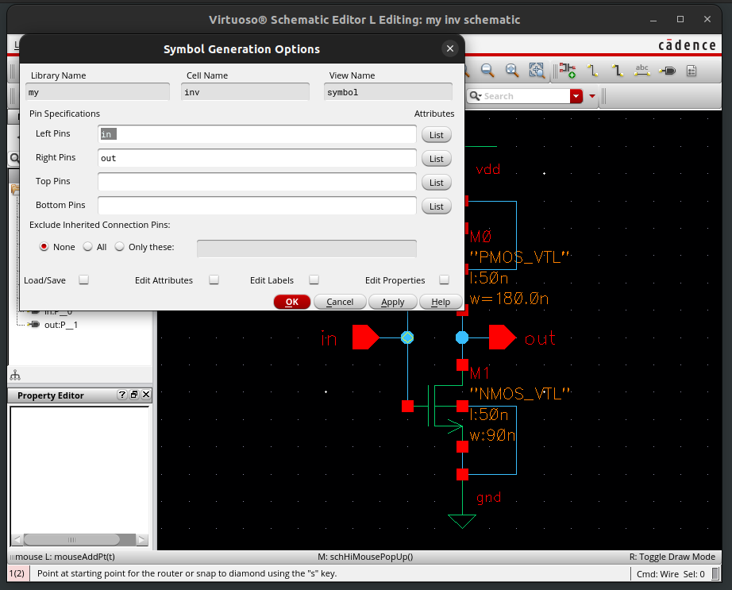

# 1. Inverter Schematic using Virtuoso

## a. Creating a Working Directory
All your designs are stored on the ECE UNIX network, as various files and additional files are required for Virtuoso and other tools to function correctly -- even the inverter design in this tutorial will require you to manage a large number of files, not to mention more complicated designs which may refer to each other that you need to manage for labs and projects. It is therefore necessary to organize your designs into a single directory and manage them as a whole.

* First, create a new directory using the following command:
  - _Note: You can choose a different name but I suggest using 'ece429' for this tutorial._
```
mkdir ece429
```
  * Enter the directory using the following command:
```
cd ece429
```
* Now initialize it by using the following command:
  - _This command copies various files into the directory, which are required by Virtuoso and other tools._
```
ece429-init-dir
```

* Note: once a working directory is created, you don't need to create it again the next time you work in the same directory.

_WARNING: if you attempt to move the working directory, you should also update the 'cds.lib' file within the directory._

## b. Starting Virtuoso

* Now we are ready to invoke Virtuoso by using the following command:
```
virtuoso
```
You should at least see the Virtuoso Log window on the left. If the Library Manager window on the right doesn't show, you can bring it up by clicking Tools→Library Manager from the Log window. Also note that the messages showing in the Log window indicate that the FreePDK45 library is loaded successfully. This is the library defining all the parameters for the 45nm technology that we will use throughout the semester.

