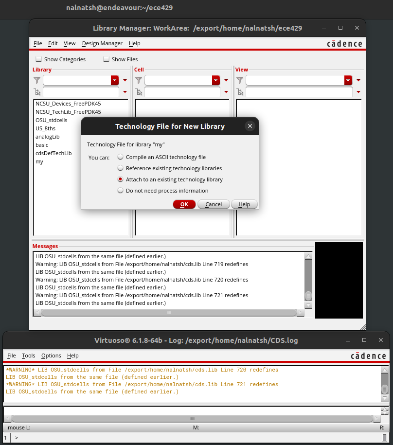
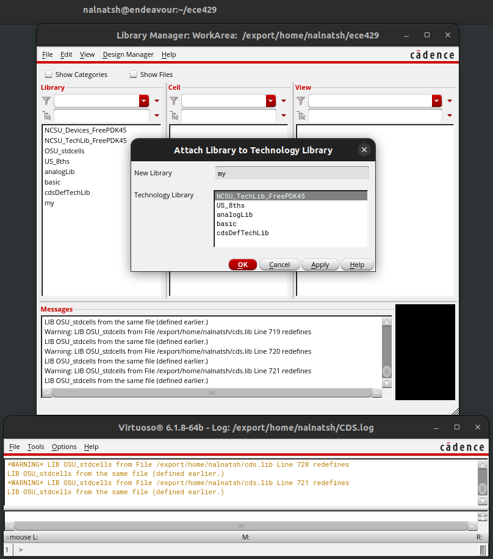
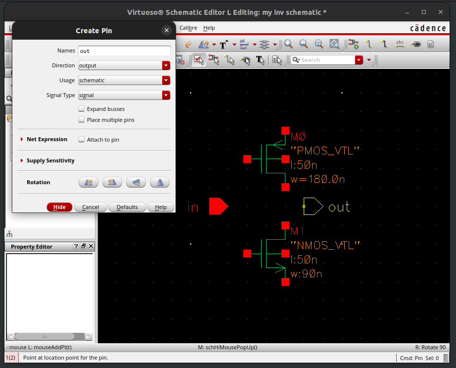

# 1. Inverter Schematic using Virtuoso

## a. Creating a Working Directory
All your designs are stored on the ECE UNIX network, as various files and additional files are required for Virtuoso and other tools to function correctly -- even the inverter design in this tutorial will require you to manage a large number of files, not to mention more complicated designs which may refer to each other that you need to manage for labs and projects. It is therefore necessary to organize your designs into a single directory and manage them as a whole.

* First, create a new directory using the following command:
  - _Note: You can choose a different name but I suggest using 'ece429' for this tutorial._
```
mkdir ece429
```
  * Enter the directory using the following command:
```
cd ece429
```
* Now initialize it by using the following command:
  - _This command copies various files into the directory, which are required by Virtuoso and other tools._
```
ece429-init-dir
```

* Note: once a working directory is created, you don't need to create it again the next time you work in the same directory.

_WARNING: if you attempt to move the working directory, you should also update the 'cds.lib' file within the directory._

## b. Starting Virtuoso

* Now we are ready to invoke Virtuoso by using the following command:
```
virtuoso
```
You should at least see the Virtuoso Log window (the bottom window). If the Library Manager window (the top window) doesn't show, you can bring it up by clicking **Tools→Library Manager** from the Log window. Also note that the messages showing in the Log window indicate that the FreePDK45 library is loaded successfully. This is the library defining all the parameters for the 45nm technology that we will use throughout the semester.


## c. The Library Manager
Our designs are physically stored as files and managed by the directory ece429. Logically, the design of a single component is called a cell in Virtuoso, and the cells are grouped into libraries for management. For example, the library 'NCSU_Devices_FreePDK45' contains a few cells representing the PMOS and NMOS transistors we are going to use to design our circuit. We are going to create our own library to manage all the cells that will be eventually created.

Click **File→New→Library** to bring out the New Library dialog box. I choose to name the library 'my'. Then click 'OK'.


A new dialog box will pop up to ask you whether a technology file should be associated. Choose 'Attach to an existing technology library' and then click 'OK'.


Choose 'NCSU_TechLib_FreePDK45' in the next dialog box and click 'OK' to proceed.


Now you should be able to see the library 'my' appearing in the Library panel in the Library Manager window.

**Note :** once a library is created, you don't need to create it again the next time you work in the same library.

## d. Creating Inverter Schematic
Generally speaking, a single component can be specified in many different ways. For example, an inverter can be specified as a pair of NMOS and PMOS transistors, sketched as an inverter symbol, implemented as a layout, or described by a boolean equation. Such relations are modeled in Virtuoso by views of cells. A cell view provides a way to specify the cell, and one of the major design tasks is to make sure that all the views are consistent, which we will cover in later tutorials.

While selecting 'my' from the Library panel, click **File→New→Cell View** to bring out the New File dialog box. Choose 'schematic' for 'Type' and name your cell 'inv'. Make sure all other fields are the same then click 'OK' to continue. If another dialog box pops up asking for licenses, click **'Always'** to avoid it to come up again.


Now you should be able to see the Virtuoso Schematic Editor window with black background and many white dots. That's the place we will draw the inverter schematic.

First of all, let's draw a PMOS transistor. Click **Create→Instance** to bring out the Add Instance dialog box. Click 'browse' for the Library Browser. Choose the 'symbol' view of the cell 'PMOS_VTL' from the library 'NCSU_Devices_FreePDK45'. You will notice that the Add Instance dialog box extends to allow you to specify parameters for the PMOS transistor. Change 'width' from 90nm to 180nm by typing '180n' into the box.


Click hide and you will see that the cursor becomes a transistor. Place it by a single clicking. Press ESC to release the transistor. Similarly, place an NMOS transistor of type 'NMOS_VTL' below the PMOS transistor with the default width of 90nm.

Next, click **Create→Pin** to bring out the Add Pin dialog box. Name it 'in' and place it to the left of the transistors. Bring out the Add Pin dialog box again, name the pin 'out', change its direction from 'input' to 'output', and place it to the right of the transistors.


We are now ready to introduce the global nets for power supply. Use Create→Instance to choose 'vdd' from 'analogLib' and place it above the transistors, and to choose 'gnd' from 'analogLib' and place it below the transistors. Click View→Fit to zoom the design to fit the screen.


Use **Create→Wire (narrow)** to wire your design. The final schematic should look like the following figure. Don't forget to connect the transistor bodies to their respective power sources.


Click **File→Check** and Save to validate and store your design. There should be no error or warning.

## e. Creating Inverter Symbol
Though we are going to simulate the inverter using its schematic, we are not going to simulate it by connecting various excitations within THIS schematic. An inverter is just an inverter -- nothing less and nothing more. We need to draw another schematic that includes our inverter and excitations for simulation.

Such hierarchical design practices would require to wrap a cell into a symbol that could be reused again and again. We have seen examples of symbols -- 'PMOS_VTL' and 'NMOS_VTL'. Now, we are going to generate a symbol for our inverter schematic.

Inside Virtuoso Schematic Editor with the inverter schematic open, click Create→Cellview→From Cellview to bring out the Cellview From Cellview dialog box. Everything should be ready by default but please make sure you are converting from 'schematic' to 'schematicSymbol' and both options 'Display Cellview' and 'Edit Options' are checked.


Click OK to bring out the Symbol Generation Options dialog box. Everything should be ready by default but please pay attention to where the pins should be placed.


Click OK and you will see the inverter symbol in Virtuoso Symbol Editor.


You may edit the symbol as you like. I am fine with the symbol and will click File→Check and Save to validate and store the symbol. There should be no error or warning.

Now you can close both Virtuoso Schematic Editor and Virtuoso Symbol Editor. Inside Library Manager, you should be able to see and preview the two views 'schematic' and 'symbol' of the cell 'inv' in the library 'my'. These two views are consistent since their pins are the same.


# 3. Inverter Simulation using HSPICE
## a. Creating Testing Circuit
We are now ready to draw a testing circuit to test our inverter schematic. For this purpose, create a cell called 'lab2' in the library 'my' and choose 'schematic' as its type.


Similar to the inverter schematic, create an instance of our inverter from the 'symbol' view of the cell 'inv' in the library 'my' and place it. Moreover, introduce the global nets 'vdd' and 'gnd' from 'analogLib'.

To add excitations, first add an instance of 'vdc' from 'analogLib'. Modify its 'DC voltage' to 1.1 before placing it under 'vdd'.


Then add an instance of 'vpulse' from 'analogLib'. We need to modify the following properties: 'Voltage 1'=0, 'Voltage 2'=1.1, 'Period'=100p, 'Delay time'=0, 'Rise time'=10p, 'Fall time'=10p, 'Pulse width'=40p. Note that you can change the properties of an instance after placing it by first selecting it and then clicking **Edit→Properties→Objects**.


Finally, add an instance of 'cap' from 'analogLib' with 'Capacitance'=1f as the load of the inverter and wire the circuit as shown below. You may also want to use **Create→Wire Name** to name the input and the output wires of the inverter to 'vin' and 'vout' respectively.


## b. Exporting SPICE Netlist
Although we can complete SPICE simulations within Virtuoso, we prefer to export a SPICE netlist from our schematic and to complete the simulations externally because the device parameters in SPICE netlists can be easily modified by any text editor.

Inside Virtuoso Schematic Editor with the schematic open, click **Launch→ADE L** to bring out the Virtuoso Analog Design Environment window.

Click **Setup→Simulator/Directory/Host** to bring out the Choosing Simulator/Directory/Host dialog box. Change 'Simulator' to 'hspiceD' and then click 'OK'.


Click **Setup→Model Librarie**s to bring out the Model Library Setup dialog box. Click 'Click here to add model file' and then click the '...' on the right to choose the file 
'''
/apps/FreePDK45/ncsu_basekit/models/hspice/hspice_nom.include
'''
Click OK to continue.


Click **Analyses→Choose** to bring out the Choosing Analyses dialog box. Choose 'tran' for 'Analysis' and modify the options for 'Transient Analysis' as follows: 'Start'=0, 'Stop'=200p, 'Step'=1p. Make sure it is 'Enabled' and click 'OK' to continue.


Click **Simulation→Netlist→Create** to generate the SPICE netlist. You should see a new window showing the netlist. Inside that window, click File→Save As to save it as 'lab2.sp' in the directory 'ece429'.


##  c. HSPICE Simulation
Now close everything except the terminal window. Use your favorite text editor to open 'lab2.sp' with the command:
```
gedit lab2.sp
```


Add a line
```
+    POST
```
just after the line
```
+    PSF=2
```
as part of the '.OPTION'. This command will instruct the HSPICE simulator to save the waveforms for every node in your circuit. You may also notice the line just below the added line
```
.INCLUDE '/apps/FreePDK45/ncsu_basekit/models/hspice/hspice_nom.include' 
```
That's the model file we added a while ago.

Close your editor and run the simulation with the command:
```
hspice lab2.sp | tee lab2.hspice.output
```
This will at the same time show the progress in the terminal and save it to the file 'lab2.hspice.output' for your future study.

To view the waveforms, start CosmosScope by:
```
cscope
```
Click **File→Open→Plotfiles** to open the file 'lab2.tr0'.


To plot the voltage of 'Vin', from the window with the title 'lab2.tr0', select 'v(vin)' and click the **plot** button. The voltage of 'Vin' is then shown in a panel within 'Graph0'. To plot the voltage of 'Vout' in the same panel, select 'v(vout)' and right click the panel to bring out the menu. Click **plot** from the menu and you should see both signals.


Many signal measurements are directly supported in CosmosScope to save your time. Click **Tools→Measurement Tool** to bring out the Measurement window. To measure delays, choose 'Delay' from 'Time Domain' for 'Measurement'.


The delay of a signal is always measured with respect to a reference signal. Since we are interested in the delay of the inverter, choose 'v(vout)' for 'Signal' and 'v(vin)' for 'Ref. signal'. As you may have noticed, the signal 'v(vout)' has undershoots and overshoots. Therefore, we need to set 'Reference levels' manually to '1.1' and '0' respectively. The options 'Delay Level' and 'Ref. Level' should both be '50%' per our definition of delays. Set 'Trigger' to rising and 'Ref Trigger' to 'either' and keep other options as shown. Click the **Apply** button and you will see the measure of a rising delay.


Change 'Trigger' to falling and click **Apply**. You will see a falling delay.


A more detailed analysis of the measure results can be found by clicking Graph→Measure Results. You can read all the delay values as well as their min/max, and can enable the display of all the measurements by clicking the black dots.


# 4. Hotkeys for Schematic Editing
Here is the list of the hotkeys that would speed up your schematic drawing within Virtuoso Schematic Editor.

- Select an object: press 'ESC' and then click it
- Un-select an object: press 'ESC' and then click the background
- Move an object: when no object is selected, press 'm' and then click it
- Edit the properties: press 'q' and then click the object
- Create instances: press 'i'
- Create narrow wires: press 'w'Name wires: press 'l'

Note that the editor will always show the actions associated with the mouse buttons as well as the hints to complete an action at the bottom of the screen.
