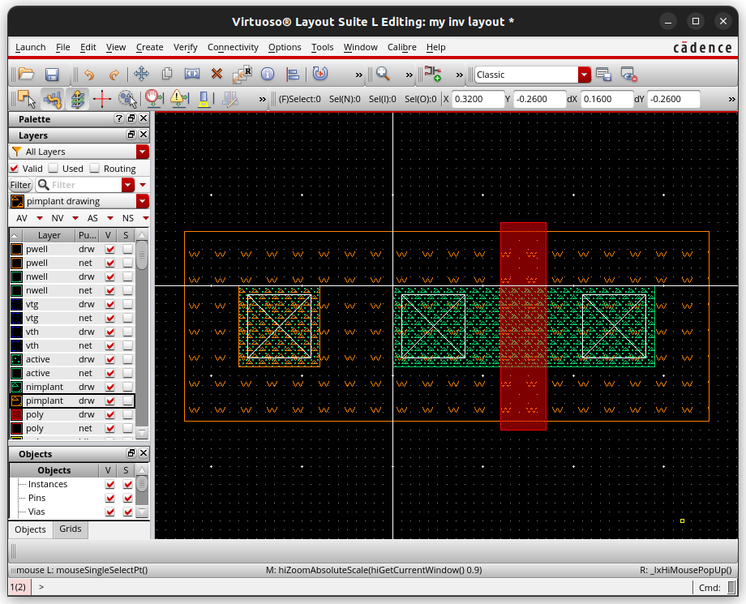
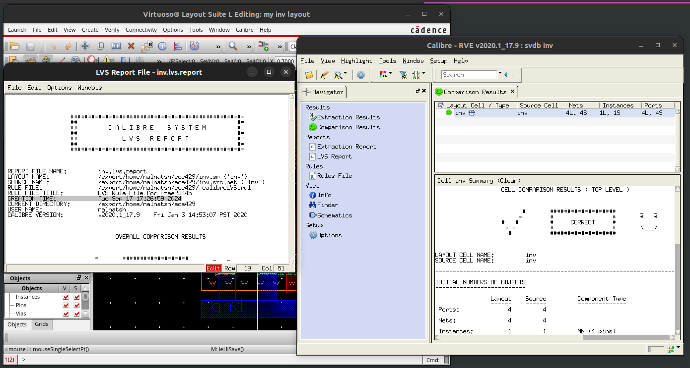

# 1. Inverter Layout using Virtuoso

## a. Starting Virtuoso and Library Manager
I would assume the working directory 'ece429' was created according to Tutorial I: Inverter Schematic and Simulation.

Now we are ready to invoke Virtuoso within the working directory, navigate to ece429 directory by typing:
```
cd ece429
virtuoso
```
You should at least see the Virtuoso Log window. If the Library Manager window doesn't show, you can bring it up by clicking **Tools→Library Manager** from the Log window.

I would assume the library 'my' and the 'schematic' view of the cell 'inv' were created according to Tutorial I.

## b. The Virtuoso Layout Editor
While selecting 'my' from the Library panel and 'inv' from the Cell panel, click **File→New→Cell View** to bring out the New File dialog box. Choose 'layout' for 'Type'. Make sure all other fields are the same then click 'OK' to continue. If another dialog box pops up asking for licenses, click 'Always' to avoid it to come up again.


Now you should be able to see the Virtuoso Layout Editor window on the right together with the LSW window on the left.


Essentially, you draw the layout in the layout editor using the layers available from the Layer Selection Window (LSW).

Since a layout is essentially a huge number of rectangular shapes with specific sizes, the first thing we need to do is to setup the grid dimensions that help make drawings easy. Click **Options→Display** to bring out the Display Options dialog. The options we need to change are located in the Grid Control panel to the top-right corner. Keep 'Type' as 'dot'. Change 'Minor Space' to '0.01' and 'Major Space' to '0.1'. Since the unit of length here is um, such setting will create a grid with bigger dots spaced at 100nm and smaller dots spaced at 10nm. Change both 'X Snap Spacing' and 'Y Snap Spacing' to '0.01' so that everything you draw is aligned to a grid of 10nm -- this is also known as the manufacturing grid. Save the settings by choosing 'Library' from the bottom row and clicking 'Save To' button.


**Note:** FreePDK45 uses a manufacturing grid of 2.5nm. In this tutorial, we use 10nm to simplify the drawing. Any multiples of 2.5nm could be used though more area would be wasted for larger ones since all layout rules should be rounded up to the alignment.

Click 'OK' to dismiss the Display Options dialog. Press 'Ctrl-G' to refresh the grid. You can move the cursor around to see how the 'X' and 'Y' change in the toolbar.


Before you start, you should familiar yourself with the inverter layout.


## c. NMOS Transistor Layout
To draw a transistor layout, we first need to decide the dimension of the active region. Since we plan to place the poly gate vertically, the transistor width will decide the height of the active region. For the NMOS transistor, it is 90nm. Note that this is the minimum width as required by ACTIVE.1.

It is much more complicated to decide the width of the active area since we need to accommodate source/drain plus contacts to metal1. The following layout rules should be observed:

- CONTACT.4   spacing between boundary of active and contact, round up to 10nm
- CONTACT.1   width of contact, round up to 70nm
- CONTACT.6   spacing between contact and poly, round up to 40nm
- POLY.1   minimum width of poly, 50nm, which is also the transistor length throughout all labs
Putting everything together, the active region should have a width of 10+70+40+50+40+70+10=290nm.

Choose 'active|drw' from the LSW window on the left. Press 'r' and drag a rectangle measuring 290nm*90nm. This will be the active region for the NMOS transistor.


You can zoom the layout using 'Ctrl-z' and 'Shift-z' and pan it using the arrow keys or mouse wheels. Now, add two 70nm*70nm contact by choosing 'contact|drw' and then a poly rectangle 50nm wide crossing the active region by choosing 'poly|drw'. You should space them according to the above layout rules. If you are not sure about the exact size/spacing of your drawing, press 'k' to bring out a ruler.


We need to make a well-tap to connect the body of the NMOS transistor to GND. This would require a separated active region that can accommodate a contact. Based on aforementioned rules CONTACT.4 and CONTACT.1, the dimension should be 90nm*90nm. The rule ACTIVE.2 further demands a spacing of 80nm between the two active regions. As an alternative to draw a new contact, you can make a copy of the existing contact by first press 'c' and then click on the existing contact.


We are ready to draw the pwell to hold all the previous drawing. The rule ACTIVE.3 demands a enclosure of 60nm (round up from 55nm). Choose 'pwell|drw' from LSW and draw a rectangle measuring 580nm*210nm that encloses the active areas. Note that if you cannot draw a rectangle of the exact size at a time, you can always press 's' and then select an edge in the rectangle to stretch it to the correct position.


Stretch the both ends of the poly gate to at least 60nm beyond active according to POLY.3. I make it 70nm so that it won't interfere with the pwell boundary.


Don't forget to overlap the two active regions with the correct types of implants. The active region for the NMOS transistors should use 'nimplant|drw' and the active region for the well-tap should use 'pimplant|drw'.


Finally, we create the GND rail and make connections using metal1. The following layout rules should be observed:

- METAL1.1   minimum metal1 width, round up to 70nm
- METAL1.2   minimum metal1 spacing, round up to 70nm
- METAL1.3   enclosure between metal1 and contact, round up to 40nm

Note that all the rectangles of the same layer are connected as long as their borders touch.


## d. Design Rule Checking
Due to the overwhelming number of layout rules, it is very likely you will miss some during your layout design. It will be very difficult for you to modify your layout once you have everything there. Therefore, it is important for you to locate the errors and correct them as early as possible. This goal is achieved by using a design rule checking (DRC) tool to check your design frequently.

The DRC tool we are going to use is part of Calibre from Mentor Graphics. When Virtuoso loads the FreePDK45 library, Calibre is integrated into the Virtuoso framework and the layout rules are imported. We can therefore go directly to use it without any further configuration.

Click **Calibre→Run DRC** to bring out the Calibre Interactive DRC window. It will take a while to settle and then we don't need to change anything.


Click 'Run DRC' from the right panel to start design rule checking. It's OK to overwrite those '.db' files when there are dialog boxes asking for your permission, or you can simply check 'Don't show this dialog again'. Wait a while until it finishes. There will be a summary report and a Calibre RVE window allowing you to look through errors. If there is any error, you can further use the interactive window to highlight the errors directly on your layout.


Once you correct all errors, you may close the report and the Calibre RVE window. You can leave the Calibre Interactive DRC window open so the layout can be checked frequently.

## e. Inverter Layout
We can draw the layout of the PMOS transistor using that of the NMOS transistor as a template. Click the 'NS' button in the LSW window, which will make all layers not selectable. Then right click 'active|drw', 'contact|drw', and 'poly|drw'. Drag a big box around the NMOS transistor and you'll find only the above three layers are selected.


Press 'c' and click on any part of the selection to make a copy. Place the copy above the NMOS transistor. This will eventually become the PMOS transistor.


Since the width of the PMOS transistor is 180nm, we need to stretch (press 's') the active region to have a height of 180nm. The poly gate should be stretched as well. On the other hand, it is not necessary to change the widths and horizontal spacings, which save us a lot of work. After adding the correct types of implants and drawing a nwell, you will have the PMOS transistor ready as follows.


Run DRC again. This time it shows 4 errors!


Expand 'Check Well.2' and then double click the '1' in the top-right panel. You will notice the bottom of the nwell and the top of the pwell are highlighted in your layout -- that's where the rule Well.2 fails. You can read the rule from the bottom-right panel without going online -- pwell and nwell should be separated by at least 225nm.


The other three errors are with the contacts. The rule says contacts should be inside metal1 and active or poly. This will not be a concern once we connect them to metal1.

To correct the Well.2 error, first close the report and the Calibre RVE window. Click the 'AS' button in the LSW window to make all layers selectable. Drag a big box around the PMOS transistor to select it, press 'm' and click on any part of the selection to move it up. You may use a ruler (press 'k') to make sure the spacing is large enough.


Run DRC again, the Well.2 error should be gone.

Finally, use metal1 to create VDD rail and make necessary connections. You should also connect the polys for the input and connect it to the metal1 layer in order to make hierarchical design easier. The whole inverter layout is shown as follows.

Run DRC again. There should be no error.

# 2. Layout vs Schematic (LVS) Verification
While DRC ensures there will be no violation of layout rules, it does not guarantee your layout has the correct functionality. In other word, we need to verify your inverter layout will actually work as an inverter. This is done by using the layout-vs-schematic (LVS) tool that is also part of Calibre. The LVS tool will take a schematic and a layout as the inputs and output whether the two are actually constructed with the same set of transistors and interconnections.

## a. Create Pins
The functionality of a circuit depends on how the inputs and the outputs are labeled. In order to perform LVS between the inverter we designed in Tutorial I and the layout we drew, we need to make sure they have the same inputs and outputs. In other words, we need to update our layout to name the interconnections with proper names. In a layout, the inputs, the outputs, and the power supplies are collectively called pins. Don't confuse these with the pins in the schematic editor where only inputs and outputs count.

Click **Create→Pin** to bring out the Create Shape Pin dialog box. Put 'vdd!' into 'Terminal Names' and check 'Display Terminal Name'. Click the 'Display Terminal Name Option' button to bring up the Terminal Name Display dialog box. Change 'Height' to 0.05 (remember the metal1 width is 70nm, i.e. 0.07). Change 'Layer' to 'metal1 drw' since all our pins are connected to the metal1 layer.


Click 'OK' to return to the Create Shape Pin dialog box and then 'Hide'. Click on your VDD rail and draw a small metal1 rectangle within the VDD rail. You should see the pin name 'vdd!' appears. Place it into the VDD rail. Repeat with 'gnd!', 'in' and 'out'. You should then have all the 4 pins ready.

Don't forget to save your updates!

## b. Run LVS
Click Calibre→Run LVS to bring out the Calibre Interactive nmLVS window. It will take a while to settle with the 'Inputs' button showing the 'Layout' tab. Make sure it is 'Export from layout viewer'.


Switch to the 'Netlist' tab. This is where the schematic should come from. Make sure it is 'Export from schematic viewer'. You may save some LVS running time later by uncheck that option if you know the file 'inv.src.net' is up-to-date.


Click 'Run LVS' from the right panel to start LVS. There will be a summary report and a Calibre RVE window allowing you to look through errors. If everything is good, you should see the famous smiley face in both.


If something is wrong, e.g. the widths of the transistors don't match, you can use the Calibre RVE window to find the detailed information.


# 3. Parasitic Extraction and Post-Layout Simulation
With all the information available from the inverter layout, we have better chance to predict its actual behavior in the real world than the schematic simulation as introduced in Tutorial I, which only considers the transistor models. The first step is to extract parasitics, especially the parasitic capacitances from the layout. Then we can simulate the inverter layout using the extracted parasitics and the transistor models, which is usually known as post-layout simulation.

## a. Parasitic Extraction
Click **Calibre→Run PEX** to bring out the Calibre Interactive PEX window. It will take a while to settle with the 'Inputs' button showing the 'Layout' tab. Make sure it is 'Export from layout viewer'.


Switch to the 'Netlist' tab. Make sure it is 'Export from schematic viewer'.


Click the 'Outputs' button from the right panel. The 'Extraction Type' should be 'Transistor Level', 'C + CC', and 'No Inductance'. In the 'Netlist' tab, the 'Format' should be 'HSPICE' and the 'Use Names From:' should be 'SCHEMATIC'.


Click 'Run PEX' from the right panel to start parasitic extraction. The Calibre Interactive PEX window should show no error and there is a new window showing the extracted model of your inverter.


Close Virtuoso as we are going to use HSPICE to simulate the layout.

## b.Post-Layout Simulation
In the 'ece429' directory, locate the file 'lab2.sp' you have obtained in Tutorial I. Copy the 'lab2.sp' to the directory 'ece429' holding 'inv.pex.netlist' with the command:
    cp lab2.sp lab3.sp

'In 'lab3.sp', comment out (use '*') every line between '.subckt inv ...' to '.ends inv'. Then add a line

```
.INCLUDE "inv.pex.netlist"
```

Finally, replace the line

```
xi0 vin vout inv
``

with

```
xi0 vin gnd! vdd! vout inv
```

Follow Tutorial I to simulate 'lab3.sp' using HSPICE and then measure the delays using CosmosScope. You'll find the difference between schematic simulation and layout simulation.


