# Since network failure may interrupt your operation, please save your data often.

# ECE429 Lab5 - Tutorial III: Hierarchical Design and Formal Verification
Created by Jia Wang, Aug. 2011, Revised by Erdal Oruklu, February 2013. Updated by Ken Choi, Fall 2019; Feb. 2020; Jan. 2021; Jan. 2022

# Overview
This tutorial introduces you to hierarchical design and formal verification techniques that are essential to build complex circuits. We will build a 2-input AND gate from a NAND gate and an inverter using the Cadence Virtuoso platform. Then we will verify its functionality formally using the Synopsys Formality ESP equivalence checker.

## Table of Contents
1. Hierarchical Schematic Design using Virtuoso
2. Hierarchical Layout Design using Virtuoso
3. Equivalence Checking using Formality ESP


# 1. Hierarchical Schematic Design using Virtuoso
I would assume you have completed Tutorial I, Tutorial II, and Lab 4 in the working directory 'ece429'. Start Virtuoso:
```
cd ece429
virtuoso
```

Create a cell 'and2' and its 'schematic' view for our 2-input AND gate design. Assume your 2-input NAND gate design from Lab 4 is a cell 'nand2' in the library 'my'. Similar to Tutorial I, create an instance of the inverter from the 'symbol' view of the cell 'inv', and an instance of the NAND gate from the 'symbol' view of the cell 'nand2'. Introduce two input pins 'a' and 'b', and one output pin 'f'. Wiring them accordingly to form a 2-input AND gate design.
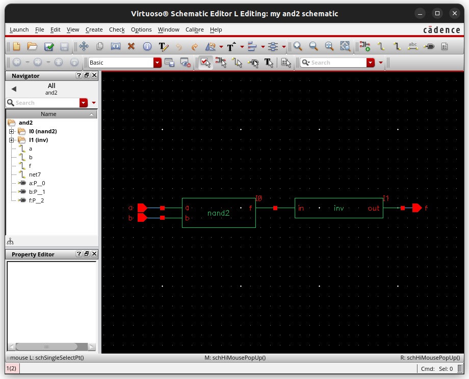

# 2. Hierarchical Layout Design using Virtuoso

## a) Layout of 2-Input NAND Gate
Create the 'layout' view of the cell 'nand2'. Draw the layout of a 2-input NAND gate. Run DRC/LVS and correct all errors.
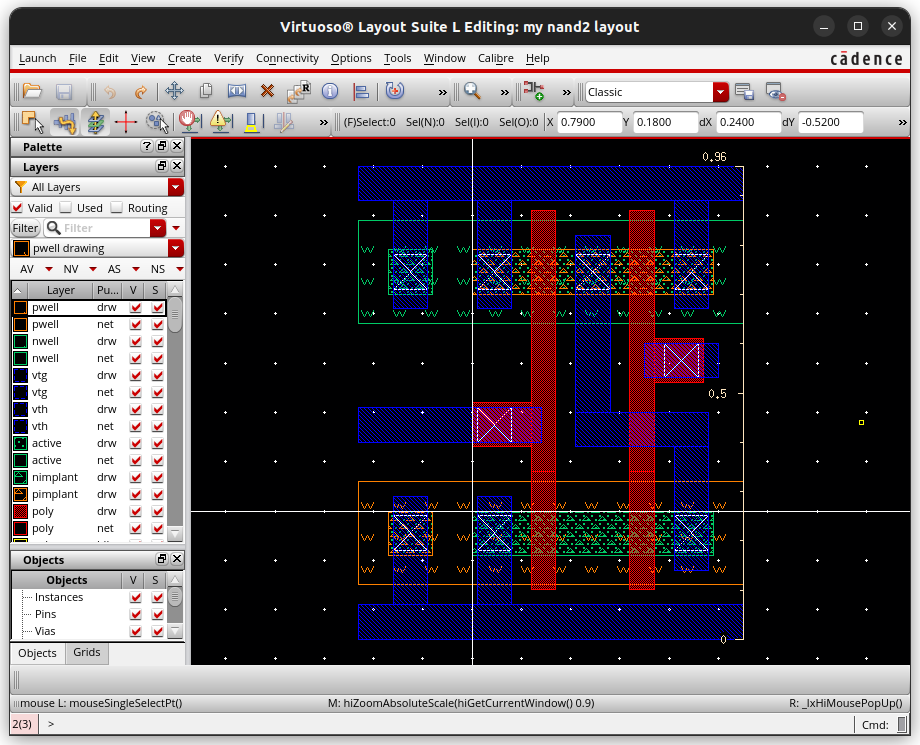


## b) Hierarchical Layout Design
Create the 'layout' view of the cell 'and2'. Within the layout editor, create an instance of the NAND gate layout from the 'layout' view of the cell 'nand2'.
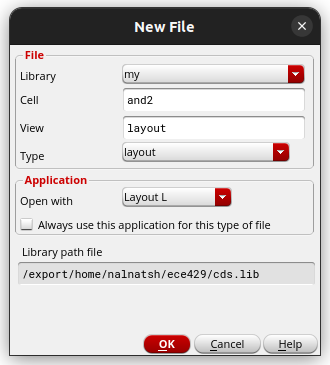

Place the instance of the NAND gate layout and then create and place an instance of the inverter layout from the 'layout' view of the cell 'inv'. For simplicity, make the layouts abut.
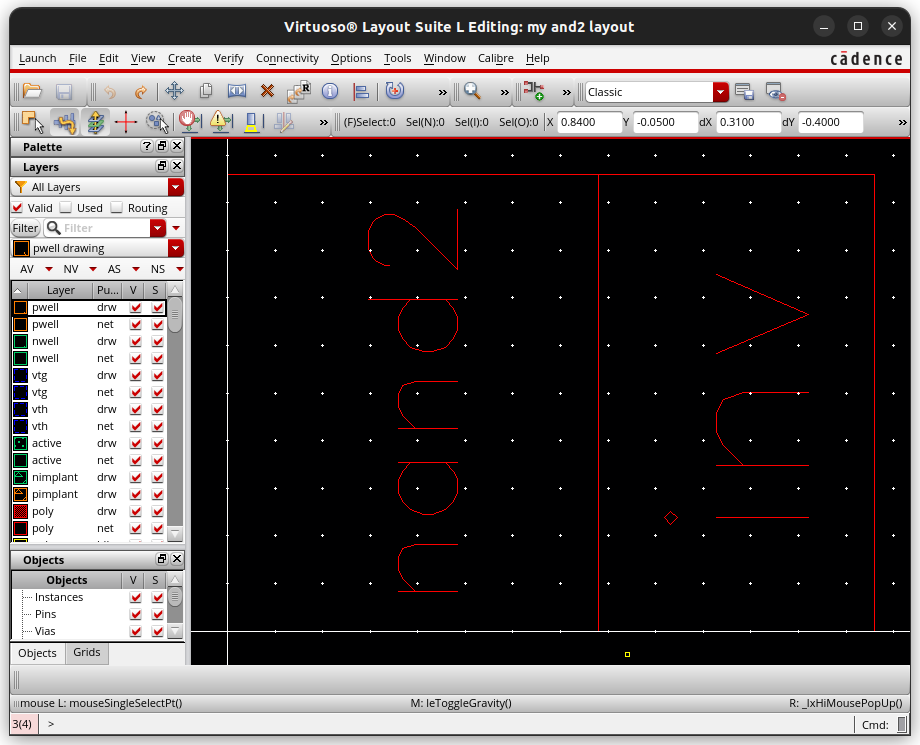

Bring out the Display Options dialog. Uncheck 'Pin Names' in 'Display Controls'. Then change 'Stop' under 'Display Levels' to 1.
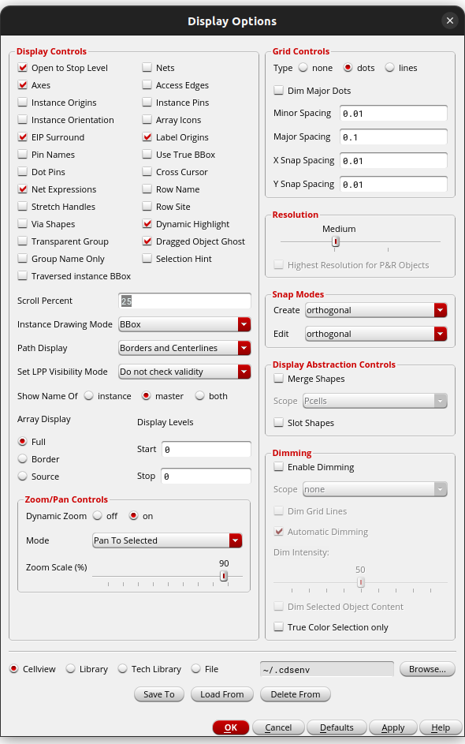

Click 'OK' and you should be able to see 'through' the NAND gate and the inverter for their layouts. Also note that you can change the 'Display Stop Level' directly on the toolbar.
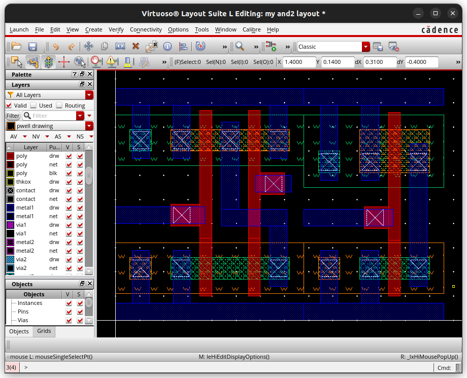

Use a 'metal1|drw' rectangle to connect the 'nand2' output to the 'inv' input. Note that although logically there exists a hierarchy, physically rectangles within different cells but on the same layer belong to a single layer. Therefore you can connect a metal1 rectangle in 'nand2' to a metal1 rectangle in 'inv' using a metal1 rectangle at the top-most level.
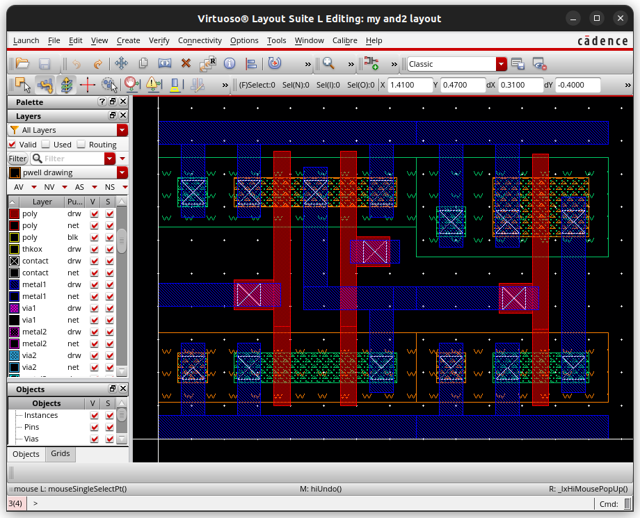

Note that since we design the layouts of 'nand2' and 'inv' to have the same height, the VDD and the GND rails in the layouts are connected automatically. Run DRC and there should be no error.

Now we need to introduce pins to the layout so we can run LVS. To make this task easy, draw a few 'metal1|drw' rectangles to overlap the inputs and the output of the 2-input AND gate. Don't forget the VDD and the GND rail. Bring out the Display Options dialog again. Check 'Pin Names' in 'Display Controls' and change 'Stop' under 'Display Levels' to 0. You should see only the rectangles at the top-most level.


Add the pins to the layout. Run LVS and there should be no error.
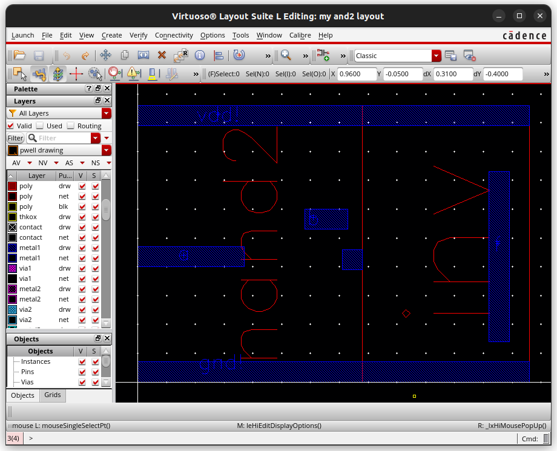


# 3. Equivalence Checking using Formality ESP
While you can always validate the functionality of your schematic/layout designs by SPICE or other simulation techniques, it will become prohibitive for complex VLSI designs -- technically, you need to double the number of the input patterns for every additional bit of input. Formal verification techniques provide an alternative to verify the functionality of your designs using mathematics, and become a must-have in today's VLSI design flow because of the complexity in the designs.

One of the most mature formal verification techniques is called equivalence checking that determines whether two designs have the same functionality. Usually one of the two designs, called the reference, is easier to make error-free and the other, called the implementation, is prone to errors. Equivalence checking can effectively detect errors in the implementation as the discrepancies between the two.

In some sense, LVS is one example of equivalence checking: any error in the layout can be detected using the schematic. However, as the complexity of the circuit increases, it will become more difficult to make the schematic designs correct. Therefore, we need to introduce designs at higher abstraction levels and use tools supporting equivalence checking at such levels to verify the schematics. In this tutorial, we will introduce Formality ESP that supports to verify a schematic as a SPICE netlist against a Verilog model.

## a) Prepare a Verilog file for AND Gate
Create the Verilog description of a 2-input AND gate in the file 'and2.v' as follows.
```
module and2(a,b,f);
 input a;
 input b;
 output f;
 assign f = a&b;
endmodule
```
In case you don't have any previous experience with Verilog, the above code defines a module 'and2', i.e. something represents a gate in Verilog, with two inputs 'a' and 'b' and one output 'f'. The line starts with 'assign' defines the relationship between the inputs and the output -- an AND gate. Note that I match the names for the module, the inputs, and the output with our 'and2' schematic in order to make the equivalence checking easier. We will stop here on Verilog since that is all you need to know to complete this tutorial.
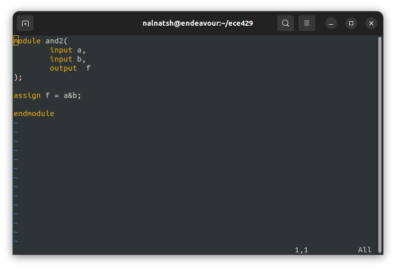


## b) Equivalence Checking of Verilog and Schematic
Start Formality ESP:
```
esp -gui
```
You will see a guided interface to perform equivalence checking: the steps are numbered from 1 to 6 and you won't be able to proceed to the next step without completing the current step correctly.
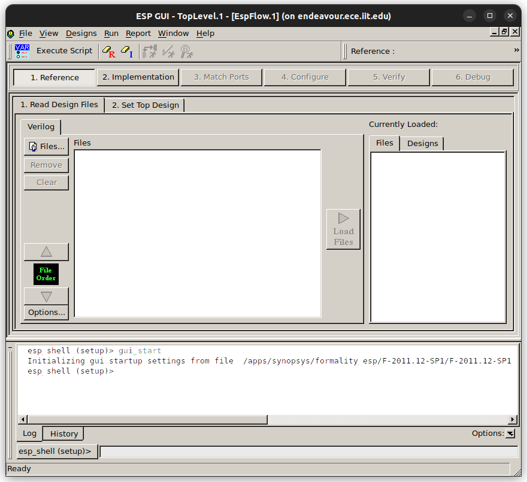

To complete the first step '1. Reference', we need to first appoint a reference design in Verilog. Click the 'Files...' button to choose 'and2.v'. The 'Load Files' button in the middle will then be enabled. Click it to load 'and2.v' into 'Currently loaded'. There should be no error in the Log window at the bottom.
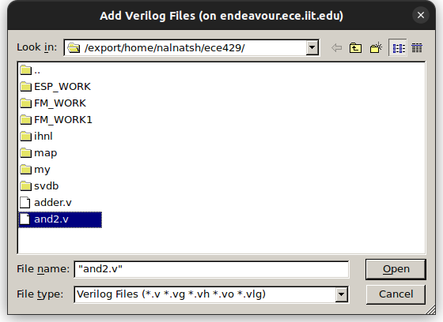

The second part of the first step is to 'Set Top Design', which tells the tool which module to check as there may exist many modules in a Verilog file. Click '2. Set Top Design', choose 'and2', and then click 'Set Top' on the right. The green check to the side of '1. Reference' appears to indicate the step is completed correctly.
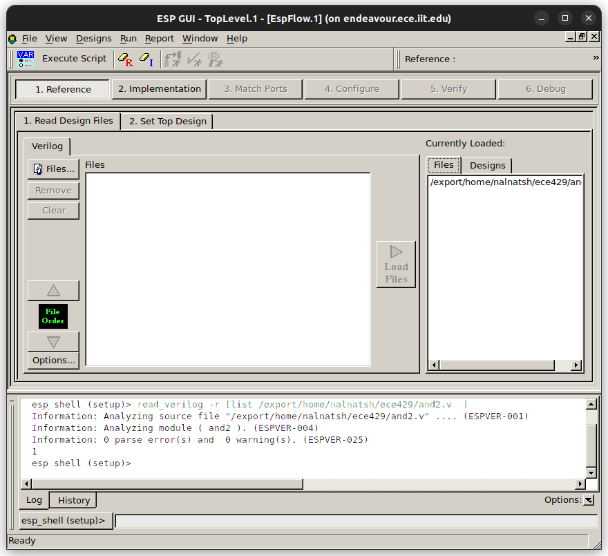

Move to the step '2. Implementation'. Choose and load the SPICE netlist 'and2.src.net', which should be generated by LVS before.
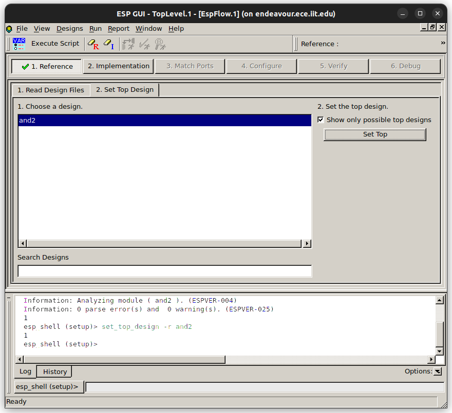

Switch to '2. Set Top Design', choose 'and2' and then 'Set Top'. You are done with the second step.
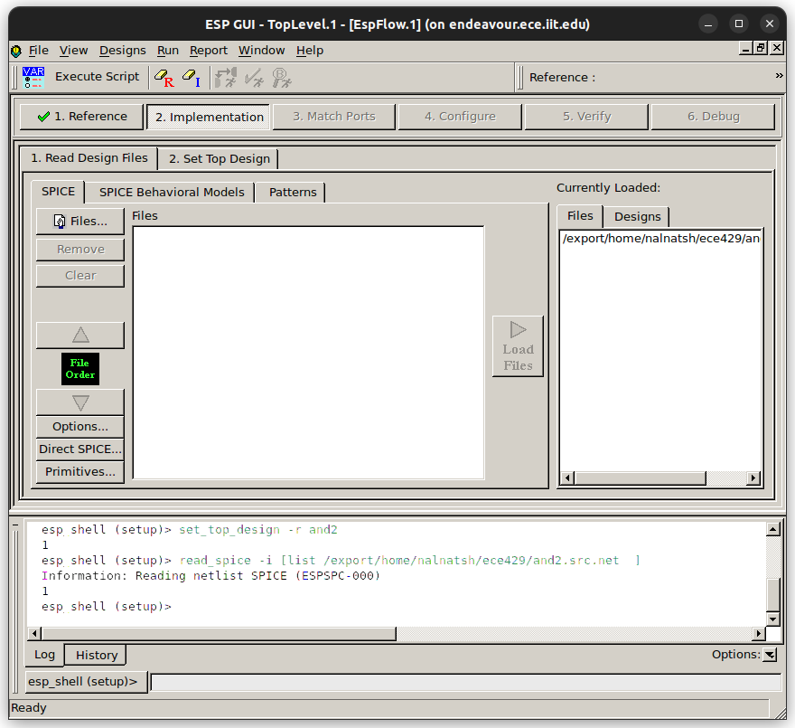

Move to the step '3. Match Ports'. Click 'Run Matching' to match the inputs/outputs of the two designs. Since we use the same name for inputs/outputs in the schematic and the Verilog file, three pairs of matched ports will be identified automatically.
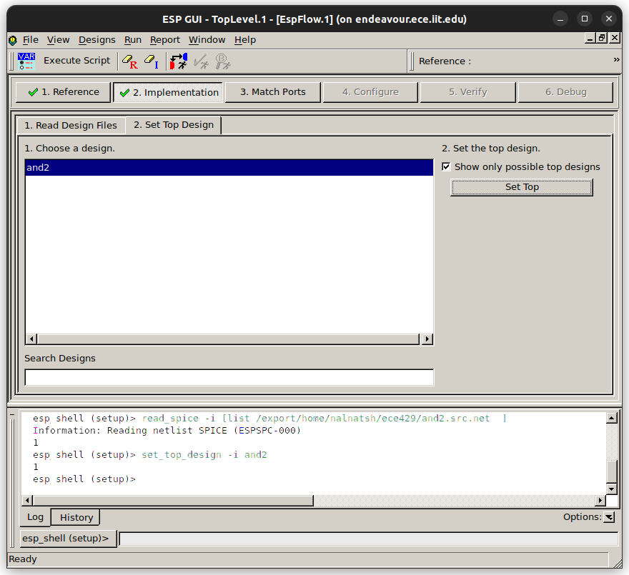

Note that the Log window shows three warnings. The tool must know which voltage level in the SPICE netlist corresponds to a logical '0' or '1' in the Verilog file. By default, it assumes active high, which means VDD represents '1' and GND represents '0'.

Move to the step '4. Configure'. Make sure 'vdd!' and 'gnd!' are listed under 'Supply Nets' and their corresponding logic values are correct.
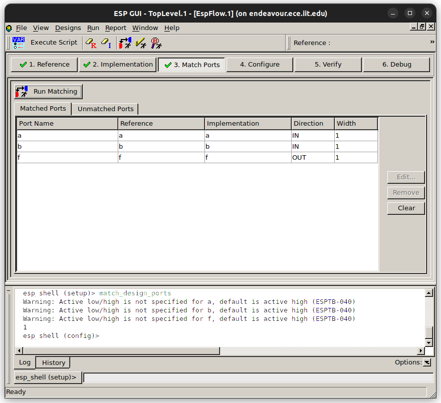

Move to the step '5. Verify'. Click 'Run Verify'. You should see the green 'Passed' for the 'Symbolic' testbench. This indicate the two designs -- the Verilog file and the SPICE netlist, are equivalent. So your 'and2' schematic design is correct!
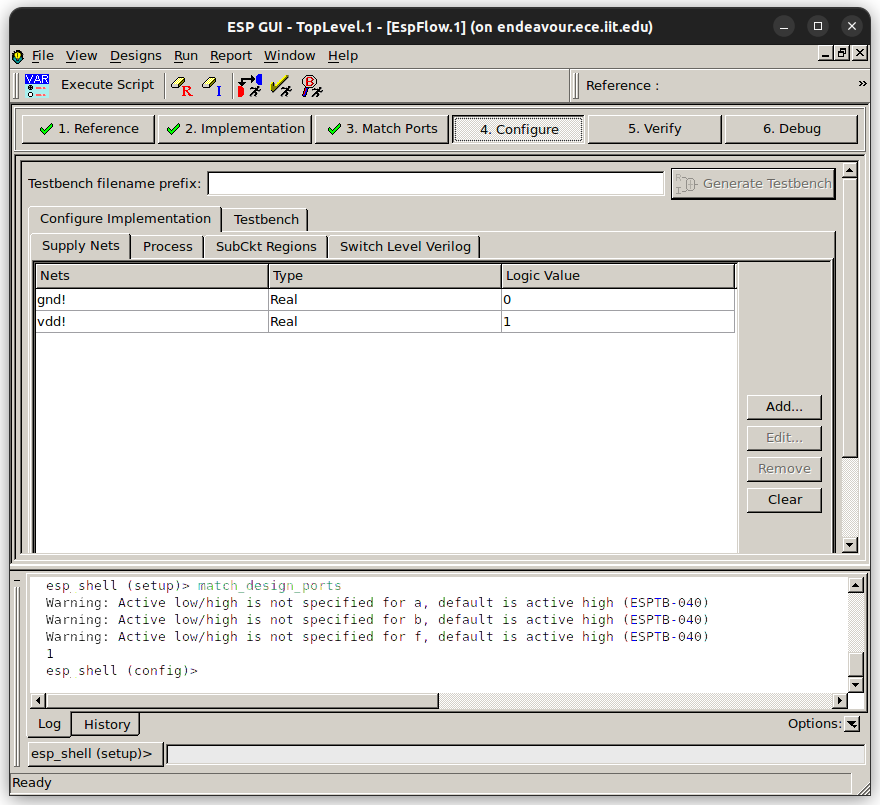


On the other hand, if the two designs are not equivalent, say you have replaced
```
assign f=a&b;
```
with
```
assign f=a|b;
```
in your 'and2.v'. Then you will see the red 'Failed'.
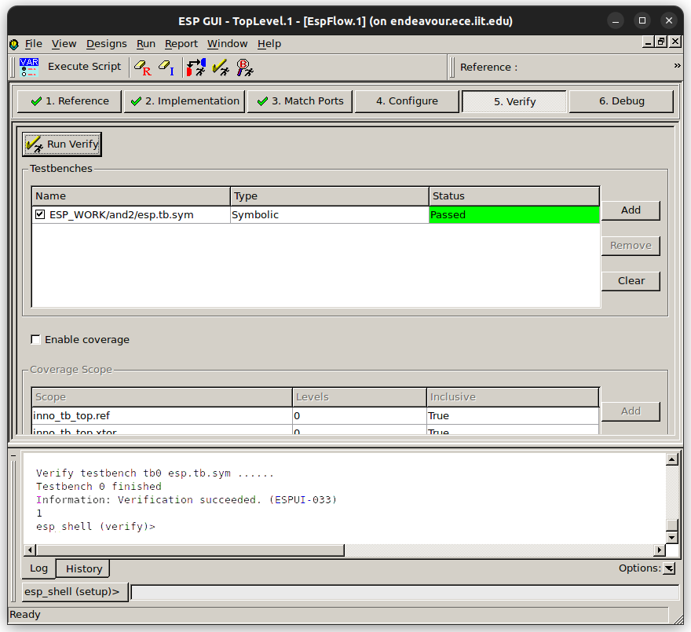

In such case, you can proceed to '6. Debug' to see the problem. The tool will generate a set of inputs that make the two designs to output different outputs, which serve as both an evidence for the failed equivalence checking and a start-point for you to locate the issue in your designs.
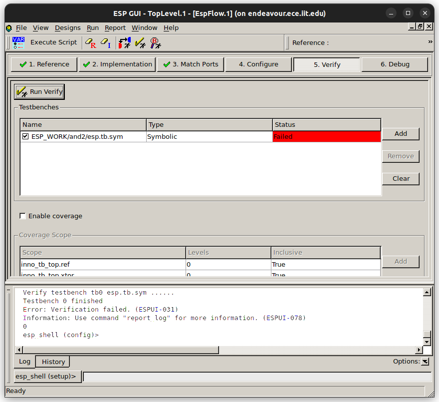

