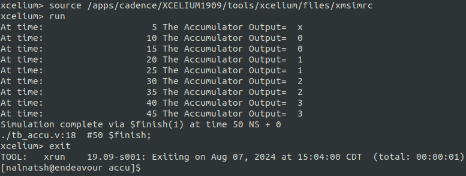
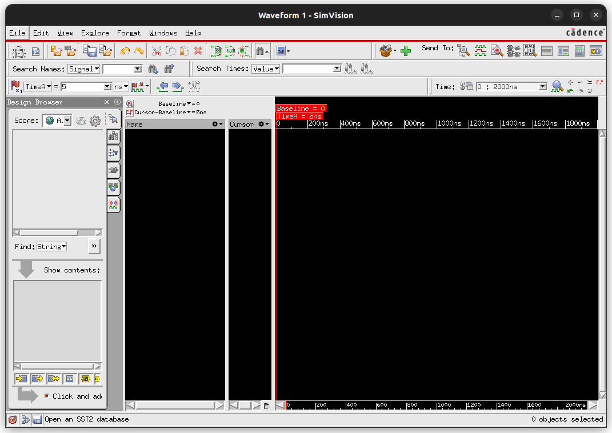
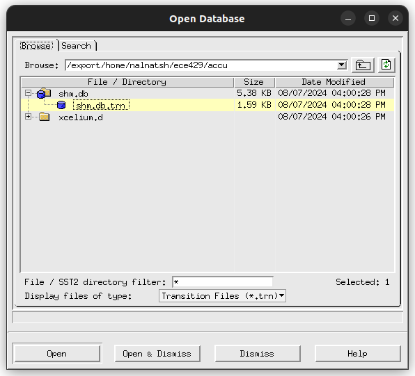
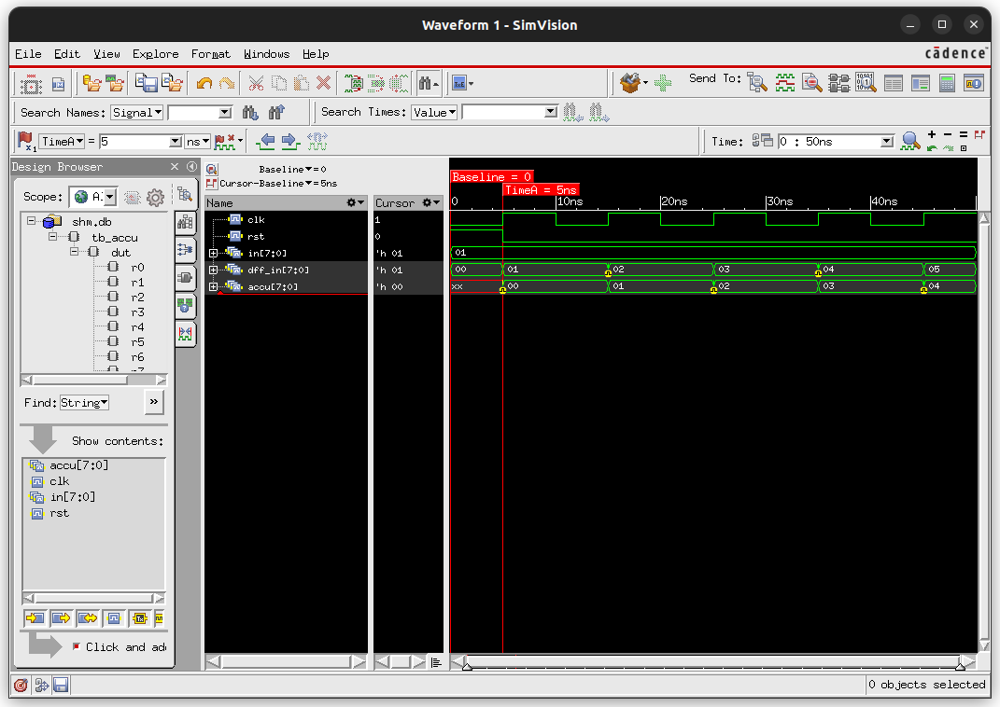

# Tutorial IV: Standard Cell Based ASIC Design Flow

## Overview:
This tutorial introduces you to the standard cell based ASIC design flow using tools and libraries from various vendors. We will use the Nangate 45nm standard-cell library with the FreePDK45 to implement an 8-bit accumulator design. We will first synthesize the design using the Synopsys Design Compiler and then perform place and route using the Cadence Innovus. The final layout will be painted in the Cadence Virtuoso platform and the final design will be verified by the Synopsys Formality Equivalence Checker.

Note: Since network failure may interrupt your operation, please save your data often.

## Table of Contents:
1. RTL Simulation
2. Logic Synthesis using Synopsys Design Compiler
3. Place and Route using Cadence Innovus
4. Layout Printing using Cadence Virtuoso

Create and initialize a directory for lab 9
```
source /import/scripts/ece429.cshrc
source /import/scripts/hspice.cshrc
source /import/scripts/synopsys2012.cshrc
mkdir accu
cd accu
ece429-init-dir
```
---

### **1. RTL Simulation**

#### **Step 1:**
Typically you enter code in Verilog on the Register-Transfer Level (RTL), where you model your design using clocked registers, datapath elements and control elements. You will use Cadence Verilog-XL to simulate your design. You will also need to create a Verilog testbench for your circuit. 
In this tutorial there are 2 files as follows:

1. accu.v: Verilog RTL code for an 8-bit accumulator

```
module dff(d, q, clk);
        output  q;
        input   d;
        input   clk;
        reg     q;

always @(posedge clk)
        q <= d;

endmodule

module accu(in, accu, clk, rst);
        output  [7:0]   accu;
        input   [7:0]   in;
        input           clk;
        input           rst;

        wire    [7:0]   accu;
        wire    [7:0]   dff_in;

dff r0(dff_in[0], accu[0], clk);
dff r1(dff_in[1], accu[1], clk);
dff r2(dff_in[2], accu[2], clk);
dff r3(dff_in[3], accu[3], clk);
dff r4(dff_in[4], accu[4], clk);
dff r5(dff_in[5], accu[5], clk);
dff r6(dff_in[6], accu[6], clk);
dff r7(dff_in[7], accu[7], clk);

assign dff_in = rst? 8'b0: accu+in;

endmodule
```

2. tb_accu.v: Verilog testbench for accu.v

```
module tb_accu;

reg     [7:0]   in;
reg             clk;
reg             rst;
wire    [7:0]   accu;

accu dut(.in(in),
        .accu(accu),
        .clk(clk),
        .rst(rst)
);

initial
 begin
        $shm_open("shm.db", 1);
        $shm_probe("AS");
        #50 $finish;
        #100 $shm_close();
 end

initial
 begin
  clk = 1'b0;
  forever
   begin
   #5 clk = ~clk;
   $display("At time: %d The Accumulator Output=%d",$time, accu);
   end
 end

initial
 begin
        #0 rst <= 1;
           in <= 1;
        #5 rst<=0;
 end

endmodule
```

#### **Step 2:**
In order to simulate Verilog code via Cadence Verilog-XL, use this command:
```
xrun tb_accu.v accu.v +access+r
```
This testbench provides results directly on the screen and also in a waveform database. From the screen we can see that the design behaves as expected as follows.



That is, every 10ns we add 1 to the accumulator. This is expected since in the testbench a clock of 10ns is specified and the input 'in' is connected to a constant 1.

#### **Step 3:**
We use the program Cadence SimVision to look at the waveform database that was created by Verilog-XL. Type the following command:
```
simvision
```


Now we need to open the Waveform database. 
1. Click on "File" > "Open Database..." or "ctl+o".
2. Choose the directory "shm.db", which is where the file is located, and double-click on the file "shm.trn" to open it.



3. To see the contents of the waveform database, from the "Design Browser" menu on the left, click on tb_accu, and the four waveforms (accu[7:0], clk, in[7:0], rst) appears on the show contents, click on each one of them to add the waveforms.



---

### **2. Logic Synthesis using Synopsys Design Compiler**
Once you have verified that your Verilog RTL code is working correctly you can synthesize it into standard cells. The result will be a gate-level netlist that only contains interconnected standard cells.

There are template files for all the following steps already prepared for you. We will now copy those templates into our project.
```
cp /import/scripts/Nangate45nm/* .
```
(Do not forget to add a star-space-dot(* .) after the file path.)

We will use the Synopsys Design Compiler for logic synthesis. Since a hardware design requires not only the Verilog descriptions but also the specifications, we will use a script file to automate the synthesis task. The template file is provided as 'compile_dc.tcl'. Note that dc stands for Design Compiler (DC).

Please open 'compile_dc.tcl' in a text editor. Although you don't need to modify this file for this tutorial, you will need to modify it for the final project so please read the following part carefully. To make it easier to modify the file, all key values are defined in the beginning of the file.

```
#/**************************************************/
#/* Compile Script for Synopsys Design Compiler    */
#/*                                                */
#/* dc_shell -f compile_dc.tcl                     */
#/*                                                */
#/* Standard Cell Library: Nangate45nm             */
#/**************************************************/

#/**************************************************/
#/* Modify the Variable below for the project      */
#/**************************************************/

#/* All verilog files, separated by spaces         */
set my_verilog_files [list accu.v]

#/* Top-level Module                               */
set my_toplevel accu

#/* Target frequency in MHz for optimization       */
set my_clk_freq_MHz 1000

#/* The name of the clock pin. If no clock-pin     */
#/* exists, pick anything                          */
set my_clock_pin clk

#/* Delay of input signals (Clk-to-Q, Package etc.)  */
set my_input_delay_ns 0.1

#/* Reserved time for output signals (Holdtime etc.)   */
set my_output_delay_ns 0.1

#/**************************************************/
#/* No modifications needed below                  */
#/**************************************************/

define_design_lib WORK -path ./WORK
set_app_var target_library "stdcells.db"
set_app_var link_library "* stdcells.db"
analyze -format verilog $my_verilog_files
elaborate $my_toplevel
set my_period [expr 1000 / $my_clk_freq_MHz]
set find_clock [ find port [list $my_clock_pin] ]
if {  $find_clock != [list] } {
   set clk_name $my_clock_pin
   create_clock -period $my_period $clk_name
} else {
   set clk_name vclk
   create_clock -period $my_period -name $clk_name
}
set_input_delay $my_input_delay_ns -clock $clk_name [all_inputs]
set_output_delay $my_output_delay_ns -clock $clk_name [all_outputs]
check_design
compile 


#report_constraint -all_violators

set filename [format "%s%s" $my_toplevel "_post_synth.v"]
write -format verilog -output $filename

set filename [format "%s%s" $my_toplevel "_post_synth.sdc"]
write_sdc $filename

#set filename [format "%s%s"  $my_toplevel ".db"]
#write -f db -hier -output $filename -xg_force_db

redirect timing.rep { report_timing }
redirect cell.rep { report_cell }
redirect power.rep { report_power }

quit
```
1. The **target_library** variable specifies the standard cells that Synopsys DC should use when synthesizing the RTL.
2. The **link_library** variable should search the standard cells, but can also search other cells (e.g., SRAMs) when trying to resolve references in our design. These other cells are not meant to be available for Synopsys DC to use during synthesis, but should be used when resolving references. Including * in the link_library variable indicates that Synopsys DC should also search all cells inside the design itself when resolving references.
3. We are now ready to read in the Verilog file which contains the top-level design and all referenced modules. We do this with two commands.
4. The analyze command reads the Verilog RTL into an intermediate internal representation.
5. The elaborate command recursively resolves all of the module references starting from the top-level module, and also infers various registers and/or advanced data-path components.
6. We need to create a clock constraint to tell Synopsys DC what our target cycle time is. Synopsys DC will not synthesize a design to run “as fast as possible”. Instead, the designer gives Synopsys DC a target cycle time and the tool will try to meet this constraint while minimizing area and power. 
7. The create_clock command takes the name of the clock signal in the Verilog (which in this course will always be **clk**), the label to give this clock (i.e., ideal_clock1), and the target clock period in nanoseconds. So in this example, we are asking Synopsys DC to see if it can synthesize the design to run at 1.0GHz (i.e., a cycle time of 1000ps).
8. In an ideal world, all inputs and outputs would change immediately with the clock edge. In reality, this is not the case. We need to include reasonable delays for inputs and outputs, so Synopsys DC can factor this into its timing analysis so we would still meet timing if we were to tape our design out in real silicon. Here, we choose 10% of the clock period for our input and output delays.
9. The **check_design** command to make sure there are no obvious errors in our Verilog RTL.
10. The **compile** command will do the synthesis.
    - During synthesis, Synopsys DC will display information about its optimization process. It will report on its attempts to map the RTL into standard-cells, optimize the resulting gate-level netlist to improve the delay, and then optimize the final design to save area.
    - The **compile** command does not perform many optimizations. Synopsys DC also includes **compile_ultra** which does many more optimizations and will likely produce higher quality of results. Keep in mind that the compile command will not flatten your design by default, while the compile_ultra command will flattened your design by default. You can turn off flattening by using the **-no_autoungroup** option with the compile_ultra command. **compile_ultra** also has the option -gate_clock which automatically performs clock gating on your design, which can save quite a bit of power. Once you finish this tutorial, feel free to go back and experiment with the compile_ultra command.
11. Now that we have synthesized the design, we output the resulting gate-level netlist in the Verilog format. We also output an .sdc file which contains the constraint information we gave Synopsys DC. We will pass this same constraint information to Cadence Innovus during the place and route portion of the flow.
12. We can use various commands to generate reports about area, energy, and timing.
    - The **report_timing** command will show the critical path through the design. Part of the report is displayed below.
      ```
      ****************************************
Report : timing
        -path full
        -delay max
        -max_paths 1
Design : accu
Version: Q-2019.12-SP1
Date   : Wed Aug  7 18:32:21 2024
****************************************

Operating Conditions: typical   Library: NangateOpenCellLibrary
Wire Load Model Mode: top

  Startpoint: in[0] (input port clocked by clk)
  Endpoint: r7/q_reg (rising edge-triggered flip-flop clocked by clk)
  Path Group: clk
  Path Type: max

  Des/Clust/Port     Wire Load Model       Library
  ------------------------------------------------
  accu               5K_hvratio_1_1        NangateOpenCellLibrary

  Point                                    Incr       Path
  -----------------------------------------------------------
  clock clk (rise edge)                    0.00       0.00
  clock network delay (ideal)              0.00       0.00
  input external delay                     0.10       0.10 f
  in[0] (in)                               0.00       0.10 f
  add_30/B[0] (accu_DW01_add_0)            0.00       0.10 f
  add_30/U1/ZN (AND2_X1)                   0.04       0.14 f
  add_30/U1_1/CO (FA_X1)                   0.09       0.22 f
  add_30/U1_2/CO (FA_X1)                   0.09       0.31 f
  add_30/U1_3/CO (FA_X1)                   0.09       0.40 f
  add_30/U1_4/CO (FA_X1)                   0.09       0.50 f
  add_30/U1_5/CO (FA_X1)                   0.09       0.59 f
  add_30/U1_6/CO (FA_X1)                   0.09       0.68 f
  add_30/U1_7/S (FA_X1)                    0.13       0.81 r
  add_30/SUM[7] (accu_DW01_add_0)          0.00       0.81 r
  U21/ZN (AND2_X1)                         0.04       0.84 r
  r7/d (dff_1)                             0.00       0.84 r
  r7/q_reg/D (DFF_X1)                      0.01       0.85 r
  data arrival time                                   0.85

  clock clk (rise edge)                    1.00       1.00
  clock network delay (ideal)              0.00       1.00
  r7/q_reg/CK (DFF_X1)                     0.00       1.00 r
  library setup time                      -0.03       0.97
  data required time                                  0.97
  -----------------------------------------------------------
  data required time                                  0.97
  data arrival time                                  -0.85
  -----------------------------------------------------------
  slack (MET)                                         0.12

      ```
              - This timing report uses static timing analysis to find the critical path. Static timing analysis checks the timing across all paths in the design (regardless of whether these paths can actually be used in practice) and finds the longest path. For more information about static timing analysis, consult Chapter 1 of the Synopsys Timing Constraints and Optimization User Guide.
    - The **report_cell** command will show the number of cells in the design.
    - The **report_power** command can show how much area each module uses and can enable detailed area breakdown analysis.


Once you have the script file ready, you can go ahead to synthesize the circuit:
```
dc_shell -f compile_dc.tcl
```
Design Compiler will run for a short time and create substantial amounts of output. When it is finished it will return to the command line. If there is an error it will specify the exact source of the error and the line number in the script that was responsible for the error. Typically there will be no errors. We can verify the initial estimations of area, timing, and power by reading into the following three files 'cell.rep', 'timing.rep', and 'power.rep'.

We can also look at the output of DC. As we said above, it is a gate-level Verilog netlist that only contains interconnected standard cells. The netlist is called 'accu.vh' and you can use any text editor to check its content. Note that the top-level module still has the name 'accu' and the names of the inputs and outputs have not changed. From the outside it is exactly the same circuit as you coded on the RTL level. But on the inside all functionality is now expressed only in terms of standard cells. A post-synthesis simulation can be performed by including Verilog models of the standard cells available from 'gscl45nm.v'. The command line is:
```
xrun gscl45nm.v accu_test.v accu.vh +access+r
```
Note how we re-used the original testbench from the RTL level simulation. That is an excellent way to ensure that the gate-level representation matches the RTL level. The simulation results should look similar to before.
