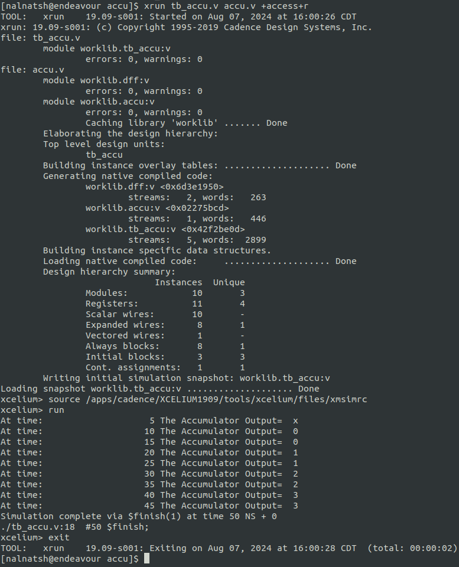

# Tutorial IV: Standard Cell Based ASIC Design Flow

## Overview:
This tutorial introduces you to the standard cell based ASIC design flow using tools and libraries from various vendors. We will use the Nangate 45nm standard-cell library with the FreePDK45 to implement an 8-bit accumulator design. We will first synthesize the design using the Synopsys Design Compiler and then perform place and route using the Cadence Innovus. The final layout will be painted in the Cadence Virtuoso platform and the final design will be verified by the Synopsys Formality Equivalence Checker.

Note: Since network failure may interrupt your operation, please save your data often.

## Table of Contents:
1. RTL Simulation
2. Logic Synthesis using Synopsys Design Compiler
3. Place and Route using Cadence Innovus
4. Layout Printing using Cadence Virtuoso

Create and initialize a directory for lab 9
```
source /import/scripts/ece429.cshrc
mkdir accu
cd accu
ece429-init-dir
```
---

## **1. RTL Simulation**

#### **Step 1: RTL Behavioral Description and Verification by Description**
In this step, you enter a code in Verilog on the Register-Transfer-Level (RTL) based on the design requirments, where you model your design using clocked registers, datapath elements and control elements. For the verification, you will use Cadence Verilog-XL to simulate your design via the testbench code.
In this tutorial there are 2 files as follows:

```
wget https://github.com/nalnatsheh/iit-ece429/blob/master/docs/tut4_std-cell-based-ASIC-design-flow/accu.v
```

```
wget https://github.com/nalnatsheh/iit-ece429/blob/master/docs/tut4_std-cell-based-ASIC-design-flow/tb_accu.v
```
1. **accu.v:** Verilog RTL code for an 8-bit accumulator

```
module dff(d, q, clk);
        output  q;
        input   d;
        input   clk;
        reg     q;

always @(posedge clk)
        q <= d;

endmodule

module accu(in, accu, clk, rst);
        output  [7:0]   accu;
        input   [7:0]   in;
        input           clk;
        input           rst;

        wire    [7:0]   accu;
        wire    [7:0]   dff_in;

dff r0(dff_in[0], accu[0], clk);
dff r1(dff_in[1], accu[1], clk);
dff r2(dff_in[2], accu[2], clk);
dff r3(dff_in[3], accu[3], clk);
dff r4(dff_in[4], accu[4], clk);
dff r5(dff_in[5], accu[5], clk);
dff r6(dff_in[6], accu[6], clk);
dff r7(dff_in[7], accu[7], clk);

assign dff_in = rst? 8'b0: accu+in;

endmodule
```

2. **tb_accu.v:** Verilog testbench for accu.v

```
module tb_accu;

reg     [7:0]   in;
reg             clk;
reg             rst;
wire    [7:0]   accu;

accu dut(.in(in),
         .accu(accu),
         .clk(clk),
         .rst(rst)
);

initial
 begin
        $shm_open("shm.db", 1);
        $shm_probe("AS");
        #50 $finish;
        #100 $shm_close();
 end

initial
 begin
  clk = 1'b0;
  forever
   begin
   #5 clk = ~clk;
   $display("At time: %d The Accumulator Output=%d",$time, accu);
   end
 end

initial
 begin
        #0 rst <= 1;
           in  <= 1;
        #5 rst <= 0;
 end

endmodule
```

#### **Step 2:**
In order to simulate Verilog code via Cadence Verilog-XL, use this command:
```
xrun tb_accu.v accu.v +access+r
```
This testbench provides results directly on the screen and also in a waveform database. From the screen we can see that the design behaves as expected as follows.



That is, every 10ns we add 1 to the accumulator. This is expected since in the testbench a clock of 10ns is specified and the input 'in' is connected to a constant 1.

#### **Step 3:**
We use the program Cadence SimVision to look at the waveform database that was created by Verilog-XL. Type the following command:
```
simvision
```


Now we need to open the Waveform database. 
1. Click on "File" > "Open Database..." or "ctl+o".
2. Choose the directory "shm.db", which is where the file is located, and double-click on the file "shm.trn" to open it.


3. To see the contents of the waveform database, from the "Design Browser" menu on the left, click on tb_accu, and the four waveforms (accu[7:0], clk, in[7:0], rst) appears on the show contents, click on each one of them to add the waveforms.


---

### **2. Logic Synthesis using Synopsys Design Compiler**
Once you have verified that your Verilog RTL code is working correctly you can synthesize it into standard cells. The result will be a gate-level netlist that only contains interconnected standard cells.

**Step 1: Copy Template Files**
There are template files for all the following steps already prepared for you. We will now copy those templates into our project.
```
cp /import/scripts/Nangate45nm/* .
```
(Do not forget to add a star-space-dot(* .) after the file path.)

We will use the Synopsys Design Compiler for logic synthesis. Since a hardware design requires not only the Verilog descriptions but also the specifications, we will use a script file to automate the synthesis task. The template file is provided as 'compile_dc.tcl'. Note that dc stands for Design Compiler (DC).

**Step 2: Script File**
Please open 'compile_dc.tcl' in a text editor. Although you don't need to modify this file for this tutorial, you will need to modify it for the final project so please read the description of the file below carefully. To make it easier to modify the file, all key values are defined in the beginning of the file.

```
#/**************************************************/
#/* Compile Script for Synopsys Design Compiler    */
#/*                                                */
#/* dc_shell -f compile_dc.tcl                     */
#/*                                                */
#/* Standard Cell Library: Nangate45nm             */
#/**************************************************/

#/* All verilog files, separated by spaces         */
set my_verilog_files [list accu.v]

#/* Top-level Module                               */
set my_toplevel accu

#/* Target frequency in MHz for optimization       */
set my_clk_freq_MHz 1000

#/* The name of the clock pin. If no clock-pin     */
#/* exists, pick anything                          */
set my_clock_pin clk

#/* Delay of input signals (Clk-to-Q, Package etc.)  */
set my_input_delay_ns 0.1

#/* Reserved time for output signals (Holdtime etc.)   */
set my_output_delay_ns 0.1

#/**************************************************/
#/* No modifications needed below                  */
#/**************************************************/

define_design_lib WORK -path ./WORK
set_app_var target_library "stdcells.db"
set_app_var link_library "* stdcells.db"

analyze -format verilog $my_verilog_files
elaborate $my_toplevel

set my_period [expr 1000 / $my_clk_freq_MHz]
set find_clock [ find port [list $my_clock_pin] ]
if {  $find_clock != [list] } {
   set clk_name $my_clock_pin
   create_clock -period $my_period $clk_name
} else {
   set clk_name vclk
   create_clock -period $my_period -name $clk_name
}
set_input_delay $my_input_delay_ns -clock $clk_name [all_inputs]
set_output_delay $my_output_delay_ns -clock $clk_name [all_outputs]

check_design
compile 

set filename [format "%s%s" $my_toplevel "_post_synth.v"]
write -format verilog -output $filename
set filename [format "%s%s" $my_toplevel "_post_synth.sdc"]
write_sdc $filename

redirect timing.rep { report_timing }
redirect cell.rep { report_cell }
redirect power.rep { report_power }

quit
```
#### Commands Desciption of the compile_dc.tcl file: 
1. The **target_library** variable specifies the standard cells that Synopsys DC should use when synthesizing the RTL.
2. The **link_library** variable should search the standard cells, but can also search other cells (e.g., SRAMs) when trying to resolve references in our design. These other cells are not meant to be available for Synopsys DC to use during synthesis, but should be used when resolving references. Including * in the link_library variable indicates that Synopsys DC should also search all cells inside the design itself when resolving references.
3. We are now ready to read in the Verilog file which contains the top-level design and all referenced modules. We do this with two commands.
   - The **analyze** command reads the Verilog RTL into an intermediate internal representation.
   - The **elaborate** command recursively resolves all of the module references starting from the top-level module, and also infers various registers and/or advanced data-path components.
4. We need to create a clock constraint to tell Synopsys DC what our target cycle time is. Synopsys DC will not synthesize a design to run “as fast as possible”. Instead, the designer gives Synopsys DC a target cycle time and the tool will try to meet this constraint while minimizing area and power.
   - The create_clock command takes the name of the clock signal in the Verilog (which in this course will always be **clk**), the label to give this clock (i.e., ideal_clock1), and the target clock period in nanoseconds. So in this example, we are asking Synopsys DC to see if it can synthesize the design to run at 1.0GHz (i.e., a cycle time of 1000ps).
   - In an ideal world, all inputs and outputs would change immediately with the clock edge. In reality, this is not the case. We need to include reasonable delays for inputs and outputs, so Synopsys DC can factor this into its timing analysis so we would still meet timing if we were to tape our design out in real silicon. Here, we choose 10% of the clock period for our input and output delays.
5. The **check_design** command to make sure there are no obvious errors in our Verilog RTL.
6. The **compile** command will do the synthesis.
    - During synthesis, Synopsys DC will display information about its optimization process. It will report on its attempts to map the RTL into standard-cells, optimize the resulting gate-level netlist to improve the delay, and then optimize the final design to save area.
    - The **compile** command does not perform many optimizations. Synopsys DC also includes **compile_ultra** which does many more optimizations and will likely produce higher quality of results. Keep in mind that the compile command will not flatten your design by default, while the compile_ultra command will flattened your design by default. You can turn off flattening by using the **-no_autoungroup** option with the compile_ultra command. **compile_ultra** also has the option -gate_clock which automatically performs clock gating on your design, which can save quite a bit of power. Once you finish this tutorial, feel free to go back and experiment with the compile_ultra command.
7. Now that we have synthesized the design, we output the resulting gate-level netlist in the Verilog format. We also output an .sdc file which contains the constraint information we gave Synopsys DC. We will pass this same constraint information to Cadence Innovus during the place and route portion of the flow.
8. We can use various commands to generate reports about area, energy, and timing.
    - The **report_timing** command will show the critical path through the design. Part of the report is displayed below.
        ```
        ...
          Point                                    Incr       Path
          -----------------------------------------------------------
          clock clk (rise edge)                    0.00       0.00
          clock network delay (ideal)              0.00       0.00
          input external delay                     0.10       0.10 f
          in[0] (in)                               0.00       0.10 f
          add_30/B[0] (accu_DW01_add_0)            0.00       0.10 f
          add_30/U1/ZN (AND2_X1)                   0.04       0.14 f
          add_30/U1_1/CO (FA_X1)                   0.09       0.22 f
          add_30/U1_2/CO (FA_X1)                   0.09       0.31 f
          add_30/U1_3/CO (FA_X1)                   0.09       0.40 f
          add_30/U1_4/CO (FA_X1)                   0.09       0.50 f
          add_30/U1_5/CO (FA_X1)                   0.09       0.59 f
          add_30/U1_6/CO (FA_X1)                   0.09       0.68 f
          add_30/U1_7/S (FA_X1)                    0.13       0.81 r
          add_30/SUM[7] (accu_DW01_add_0)          0.00       0.81 r
          U21/ZN (AND2_X1)                         0.04       0.84 r
          r7/d (dff_1)                             0.00       0.84 r
          r7/q_reg/D (DFF_X1)                      0.01       0.85 r
          data arrival time                                   0.85
        
          clock clk (rise edge)                    1.00       1.00
          clock network delay (ideal)              0.00       1.00
          r7/q_reg/CK (DFF_X1)                     0.00       1.00 r
          library setup time                      -0.03       0.97
          data required time                                  0.97
          -----------------------------------------------------------
          data required time                                  0.97
          data arrival time                                  -0.85
          -----------------------------------------------------------
          slack (MET)                                         0.12
        ```
      - This timing report uses static timing analysis to find the critical path. Static timing analysis checks the timing across all paths in the design (regardless of whether these paths can actually be used in practice) and finds the longest path. For more information about static timing analysis, consult Chapter 1 of the Synopsys Timing Constraints and Optimization User Guide.
      - The difference between the required arrival time and the actual arrival time is called the slack. Positive slack means the path arrived before it needed to while negative slack means the path arrived after it needed to. If you end up with negative slack, then you need to rerun the tools with a longer target clock period until you can meet timing with no negative slack. The process of tuning a design to ensure it meets timing is called “timing closure”. In this course, we are primarily interested in design-space exploration as opposed to meeting some externally defined target timing specification. So you will need to sweep a range of target clock periods. Your goal is to choose the shortest possible clock period which still meets timing without any negative slack! This will result in a well-optimized design and help identify the “fundamental” performance of the design. Alternatively, if you are comparing multiple designs, sometimes the best situation is to tune the baseline so it meets timing and then ensure the alternative designs have similar cycle times. This will enable a fair comparison since all designs will be running at the same cycle time.
    - The **report_cell** command will show the number of cells in the design.
    - The **report_power** command can show how much area each module uses and can enable detailed area breakdown analysis.


**Step 3: Synthesis**
Once you have the script file ready, you can go ahead to synthesize the circuit:
```
dc_shell -f compile_dc.tcl
```
Design Compiler will run for a short time and create substantial amounts of output. When it is finished it will return to the command line. If there is an error it will specify the exact source of the error and the line number in the script that was responsible for the error. We can look at the output of DC. As we said above, it is a gate-level Verilog netlist that only contains interconnected standard cells. The netlist is called **accu_post_synth.v** and you can use any text editor to check its content. 
```
module accu_DW01_add_0 ( A, B, CI, SUM, CO );
  input [7:0] A;
  input [7:0] B;
  output [7:0] SUM;
  input CI;
  output CO;
  wire   n1;
  wire   [7:1] carry;

  FA_X1 U1_7 ( .A(A[7]), .B(B[7]), .CI(carry[7]), .S(SUM[7]) );
  FA_X1 U1_6 ( .A(A[6]), .B(B[6]), .CI(carry[6]), .CO(carry[7]), .S(SUM[6]) );
  FA_X1 U1_5 ( .A(A[5]), .B(B[5]), .CI(carry[5]), .CO(carry[6]), .S(SUM[5]) );
  FA_X1 U1_4 ( .A(A[4]), .B(B[4]), .CI(carry[4]), .CO(carry[5]), .S(SUM[4]) );
  FA_X1 U1_3 ( .A(A[3]), .B(B[3]), .CI(carry[3]), .CO(carry[4]), .S(SUM[3]) );
  FA_X1 U1_2 ( .A(A[2]), .B(B[2]), .CI(carry[2]), .CO(carry[3]), .S(SUM[2]) );
  FA_X1 U1_1 ( .A(A[1]), .B(B[1]), .CI(n1), .CO(carry[2]), .S(SUM[1]) );
  AND2_X1 U1 ( .A1(B[0]), .A2(A[0]), .ZN(n1) );
  XOR2_X1 U2 ( .A(B[0]), .B(A[0]), .Z(SUM[0]) );
endmodule


module accu ( in, accu, clk, rst );
  input [7:0] in;
  output [7:0] accu;
  input clk, rst;
  wire   N3, N4, N5, N6, N7, N8, N9, N10, n5;
  wire   [7:0] dff_in;

  dff_0 r0 ( .d(dff_in[0]), .q(accu[0]), .clk(clk) );
  dff_7 r1 ( .d(dff_in[1]), .q(accu[1]), .clk(clk) );
  dff_6 r2 ( .d(dff_in[2]), .q(accu[2]), .clk(clk) );
  dff_5 r3 ( .d(dff_in[3]), .q(accu[3]), .clk(clk) );
  dff_4 r4 ( .d(dff_in[4]), .q(accu[4]), .clk(clk) );
  dff_3 r5 ( .d(dff_in[5]), .q(accu[5]), .clk(clk) );
  dff_2 r6 ( .d(dff_in[6]), .q(accu[6]), .clk(clk) );
  dff_1 r7 ( .d(dff_in[7]), .q(accu[7]), .clk(clk) );
  accu_DW01_add_0 add_30 ( .A(accu), .B(in), .CI(1'b0), .SUM({N10, N9, N8, N7,
        N6, N5, N4, N3}) );
  AND2_X1 U13 ( .A1(N3), .A2(n5), .ZN(dff_in[0]) );
  AND2_X1 U14 ( .A1(N9), .A2(n5), .ZN(dff_in[6]) );
  AND2_X1 U15 ( .A1(N4), .A2(n5), .ZN(dff_in[1]) );
  AND2_X1 U16 ( .A1(N5), .A2(n5), .ZN(dff_in[2]) );
  AND2_X1 U17 ( .A1(N6), .A2(n5), .ZN(dff_in[3]) );
  AND2_X1 U18 ( .A1(N7), .A2(n5), .ZN(dff_in[4]) );
  AND2_X1 U19 ( .A1(N8), .A2(n5), .ZN(dff_in[5]) );
  INV_X1 U20 ( .A(rst), .ZN(n5) );
  AND2_X1 U21 ( .A1(N10), .A2(n5), .ZN(dff_in[7]) );
endmodule
```
Note that the top-level module still has the name 'accu' and the names of the inputs and outputs have not changed. From the outside it is exactly the same circuit as you coded on the RTL level. But on the inside all functionality is now expressed only in terms of standard cells.

#### **Step 4: Post Synthesis Simulation**
A post-synthesis simulation can be performed by including Verilog models of the standard cells available from 'gscl45nm.v'. The command line is:
```
xrun gscl45nm.v tb_accu.v accu_post_synth.v +access+r
```
Note how we re-used the original testbench from the RTL level simulation. That is an excellent way to ensure that the gate-level representation matches the RTL level. The simulation results should look similar to before.


---

### **3. Place&Route (PnR) using Cadence Innovus**
We use Cadence Innovus for placing standard cells in rows and then automatically routing all of the nets between these standard cells. We also use Cadence Innovus to route the power and ground rails in a grid and connect this grid to the power and ground pins of each standard cell, and to automatically generate a clock tree to distribute the clock to all sequential state elements with hopefully low skew.

Before starting Cadence Innovus, we need two files which will be loaded into the tool. The first file is a .sdc file which contains timing constraint information about our design. This file is where we specify our target clock period, but it is also where we could specify input or output delay constraints. We created this file at the end of our synthesis step using Synopsys DC. Before we get started, let’s open that file to take a look at the constraint DC generated.

```
set sdc_version 2.1

set_units -time ns -resistance MOhm -capacitance fF -voltage V -current mA
create_clock [get_ports clk]  -period 1  -waveform {0 0.5}
set_input_delay -clock clk  0.1  [get_ports {in[7]}]
set_input_delay -clock clk  0.1  [get_ports {in[6]}]
set_input_delay -clock clk  0.1  [get_ports {in[5]}]
set_input_delay -clock clk  0.1  [get_ports {in[4]}]
set_input_delay -clock clk  0.1  [get_ports {in[3]}]
set_input_delay -clock clk  0.1  [get_ports {in[2]}]
set_input_delay -clock clk  0.1  [get_ports {in[1]}]
set_input_delay -clock clk  0.1  [get_ports {in[0]}]
set_input_delay -clock clk  0.1  [get_ports rst]
set_output_delay -clock clk  0.1  [get_ports {accu[7]}]
set_output_delay -clock clk  0.1  [get_ports {accu[6]}]
set_output_delay -clock clk  0.1  [get_ports {accu[5]}]
set_output_delay -clock clk  0.1  [get_ports {accu[4]}]
set_output_delay -clock clk  0.1  [get_ports {accu[3]}]
set_output_delay -clock clk  0.1  [get_ports {accu[2]}]
set_output_delay -clock clk  0.1  [get_ports {accu[1]}]
set_output_delay -clock clk  0.1  [get_ports {accu[0]}]
```

The create_clock command is similar to the command we used in synthesis, and we usually use the same target clock period that we used for synthesis. In this case, we are targeting a 1.0GHz clock frequency (i.e., a 0.6ns clock period). Note that we also see the constraints that we set for input and output delay, 

The second file is a “multi-mode multi-corner” (MMMC) analysis file. This file specifies what “corner” to use for our timing analysis. A corner is a characterization of the standard cell library and technology with specific assumptions about the process, temperature, and voltage (PVT). So we might have a “fast” corner which assumes best-case process variability, low temperature, and high voltage, or we might have a “slow” corner which assumes worst-case variability, high temperature, and low voltage. To ensure our design will work across a range of operating conditions, we need to evaluate our design across a range of corners. In this course, we will keep things simple by only considering a “typical” corner (i.e., average PVT).

Let’s open that file to take a look at it. 
```
create_rc_corner -name typical \
    -cap_table "rtk-typical.captable" \
    -T 25

 create_library_set -name libs_typical \
    -timing [list "stdcells.lib"]

 create_delay_corner -name delay_default \
    -early_library_set libs_typical \
    -late_library_set libs_typical \
    -rc_corner typical

 create_constraint_mode -name constraints_default \
    -sdc_files [list accu-post-syn.sdc]

 create_analysis_view -name analysis_default \
    -constraint_mode constraints_default \
    -delay_corner delay_default

 set_analysis_view \
    -setup [list analysis_default] \
    -hold [list analysis_default]
```
The create_rc_corner command: loads in the .captable file. This file includes information about the resistance and capacitance of every metal layer. Notice that we are loading in the “typical” captable and we are specifying an “average” operating temperature of 25 degC.   

The create_library_set command: loads in the .lib file that we examined earlier. This file includes information about the input/output capacitance of each pin in each standard cell along with the delay from every input to every output in the standard cell.  

The create_delay_corner commad : specifies a specific corner that we would like to use for our timing analysis by putting together a .captable and a .lib file. In this specific example, we are creating a typical corner by putting together the typical .captable and typical .lib we just loaded.

The create_constraint_mode command : loads in the .sdc file we mentioned earlier in this section. 

The create_analysis_view command : puts together constraints with a specific corner.  

The set_analysis_view command : tells Cadence Innovus that we would like to use this specific analysis view for both setup and hold time analysis.

Now that we understand the setup-timing.tcl file, we can start with Cadence Innovus:
Similar to logic synthesis using DC, we will use a set of script files to automate the placement and route task. All the commands for placement and route are in the template file 'encounter.tcl'.

#### Commands Desciption of the compile_dc.tcl file: 
We need to set various variables before starting to work in Cadence Innovus. These variables tell Cadence Innovus the location of the MMMC file, the location of the Verilog gate-level netlist, the name of the top-level module in our design, the location of the .lef files, and finally the names of the power and ground nets.
```
set init_mmmc_file "setup-timing.tcl"
set init_verilog "accu-post-syn.v"
set init_top_cel "accu"
set init_lef_file "rtk-tech.lef stdcells.lef"
set init_gnd_net "gnd"
set init_pwr_net "vdd"
```
We are now ready to use the init_design command to read in the verilog, set the design name, setup the timing analysis views, read the technology .lef for layer information, and read the standard cell .lef for physical information about each cell used in the design.
```
init_design
```
Then, we tell innovus the type of timing analysis we want it to do. In on-chip variation (OCV) mode, the software calculates clock and data path delays based on minimum and maximum operating conditions for setup analysis and vice-versa for hold analysis. These delays are used together in the analysis of each check. The OCV is the small difference in the operating parameter value across the chip. Each timing arc in the design can have an early and a late delay to account for the on-chip process, voltage, and temperature variation. We need this mode in order to do proper hold time fixing later on.
The next step is to do some floorplaning. This is where we broadly organize the chip in terms of its overall dimensions and the placement of any previously designed blocks. For now we just do some very simple floorplanning using the floorPlan command.
```
setAnalysisMode -analysisType onChipVariation -cppr both
```

The next step is to do some floorplaning. This is where we broadly organize the chip in terms of its overall dimensions and the placement of any previously designed blocks. For now we just do some very simple floorplanning using the floorPlan command.
```
floorPlan -r 1.0 0.70 4.0 4.0 4.0 4.0
```
In this example, we have chosen the aspect ratio to be 1.0 and a target cell utilization to be 70%. The cell utilization is the percentage of the final chip that will actually contain useful standard cells as opposed to just “filler” cells (i.e., empty cells). Ideally, we would like the cell utilization to be 100% but this is simply not reasonable. If the cell utilization is too high, Cadence Innovus will spend way too much time trying to optimize the design and will eventually simply give up. A target cell utilization of 70% makes it more likely that Cadence Innovus can successfuly place and route the design. We have also added 4.0um of margin around the top, bottom, left, and right of the chip to give us room for the power ring which will go around the entire chip.

The next step is to work on power routing. Recall that each standard cell has internal M1 power and ground rails which will connect via abutment when the cells are placed into rows. If we were just to supply power to cells using these rails we would likely have large IR drop and the cells in the middle of the chip would effectively be operating at a much lower voltage. During power routing, we create a grid of power and ground wires on the top metal layers and then connect this grid down to the M1 power rails in each row. We also create a power ring around the entire floorplan. Before doing the power routing, we need to use the globalNetCommand command to tell Cadence Innovus which nets are power and which nets are ground.

We can now draw M1 “rails” for the power and ground rails that go along each row of standard cells.
```
sroute -nets {vdd gnd}
```

We now create a power ring around our chip using the addRing command. A power ring ensures we can easily get power and ground to all standard cells. The command takes parameters specifying the width of each wire in the ring, the spacing between the two rings, and what metal layers to use for the ring. We will put the power ring on M6 and M7; we often put the power routing on the top metal layers since these are fundamentally global routes and these top layers have low resistance which helps us minimize static IR drop and di/dt noise. These top layers have high capacitance but this is not an issue since the power and ground rails are not switching (and indeed this extra capacitance can serve as a very modest amount of decoupling capacitance to smooth out time variations in the power supply).
```
addRing -nets {VDD VSS} -width 0.6 -spacing 0.5 \
            -layer [list top 7 bottom 7 left 6 right 6]
```

We have power and ground rails along each row of standard cells and a power ring, so now we need to hook these up. We can use the addStripe command to draw wires and automatically insert vias whenever wires cross. First, we draw the vertical “stripes”. And then we draw the horizontal “stripes”.
```
addStripe -nets {gnd vdd} -layer 6 -direction vertical \
            -width 0.4 -spacing 0.5 -set_to_set_distance 5 -start 0.5

addStripe -nets {gnd vdd} -layer 7 -direction horizontal \
            -width 0.4 -spacing 0.5 -set_to_set_distance 5 -start 0.5
```

Now that we have finished our basic power planning we can do the initial placement and routing of the standard cells using the place_design command:
```
place_design
```

The next step is to assign IO pin location for our block-level design. Since this is not a full chip with IOcells, or a hierarchical block, we don’t really care exactly where all of the pins line up, so we’ll let the tool assign the location for all of the pins.
```
assignIoPins -pin *
```

The next step is to improve the quality of the clock tree routing. First, let’s display just the clock tree. Now use the ccopt_design command to optimize the clock tree routing.
```
ccopt_design
```

To avoid hold time violations (situations where the contamination delay is smaller than the hold time and new data arrives too quickly) we include the following commands:
```
setOptMode -holdFixingCells {BUF_X1}
setOptMode -holdTargetSlack 0.013 -setupTargetSlack 0.044;
optDesign -postCTS -outDir timingReports -prefix postCTS_hold -hold
```
Here, we specified a list of buffer cells to the tool from stdcells.v that innovus can use to add in delays to paths that violate the hold time constraint. We then tell innovus our hold and setup time constraints, in nanoseconds, these numbers were derived from the .lib file. Then, we fix any violating paths using the optDesign command.

The next step is to improve the quality of the signal routing. Then use the routeDesign command to optimize the signal routing. We follow this with another iteration of optDesign to fix any violating paths that were created during routeDesign.
```
routeDesign
innovus> optDesign -postRoute -outDir timingReports -prefix postRoute_hold -hold
```

The final step is to insert “filler” cells. Filler cells are essentially empty standard cells whose sole purpose is to connect the wells across each standard cell row.
```
setFillerMode -corePrefix FILL -core "FILLCELL_X4 FILLCELL_X2 FILLCELL_X1"
addFiller
```

Our design is now on silicon! Obviously there are many more steps required before you can really tape out a chip. We would need to add an I/O ring with pads so we can connect the chip to the package, we would need to do further verification, and additional optimization.

For example, one thing we want to do is verify that the gate-level netlist matches what is really in the final layout. We can do this using the verifyConnectivity command. We can also do a preliminary “design rule check” to make sure that the generated metal interconnect does not violate any design rules with the verify_drc command.
```
verifyConnectivity
verify_drc
```

Now we can generate various output files. We might want to save the final gate-level netlist for the chip, since Cadence Innovus will often insert new cells or change cells during its optimization passes.
```
saveNetlist post-par.v
```

Finally, we of course need to generate the real layout as a .gds file. This is what we will send to the foundry when we are ready to tapeout the chip.
```
streamOut post-par.gds \
            -merge "stdcells.gds" \
            -mapFile "rtk-stream-out.map"
```

Run Cadence Innovus 

```
report_area
```
``` 
    Hinst Name       Module Name          Inst Count           Total Area
----------------------------------------------------------------------
accu                                              25               79.268
```

```
report_timing
```
```
    Hinst Name       Module Name          Inst Count           Total Area
----------------------------------------------------------------------
accu                                              25               79.268
innovus 4> report_timing 
###############################################################
#  Generated by:      Cadence Innovus 19.10-p002_1
#  OS:                Linux x86_64(Host ID endeavour.ece.iit.edu)
#  Generated on:      Tue Oct 22 14:09:21 2024
#  Design:            accu
#  Command:           report_timing
###############################################################
Path 1: MET Setup Check with Pin r7/q_reg/CK 
Endpoint:   r7/q_reg/D (^) checked with  leading edge of 'clk'
Beginpoint: in[0]      (v) triggered by  leading edge of 'clk'
Path Groups: {clk}
Analysis View: analysis_default
Other End Arrival Time          0.000
- Setup                         0.031
+ Phase Shift                   1.000
+ CPPR Adjustment               0.000
= Required Time                 0.969
- Arrival Time                  0.750
= Slack Time                    0.219
     Clock Rise Edge                      0.000
     + Input Delay                        0.100
     = Beginpoint Arrival Time            0.100
     +-------------------------------------------------------------------+ 
     |  Instance   |     Arc      |  Cell   | Delay | Arrival | Required | 
     |             |              |         |       |  Time   |   Time   | 
     |-------------+--------------+---------+-------+---------+----------| 
     |             | in[0] v      |         |       |   0.100 |    0.319 | 
     | add_30/U1_0 | B v -> CO v  | FA_X1   | 0.075 |   0.175 |    0.394 | 
     | add_30/U1_1 | CI v -> CO v | FA_X1   | 0.072 |   0.246 |    0.466 | 
     | add_30/U1_2 | CI v -> CO v | FA_X1   | 0.072 |   0.319 |    0.538 | 
     | add_30/U1_3 | CI v -> CO v | FA_X1   | 0.073 |   0.392 |    0.611 | 
     | add_30/U1_4 | CI v -> CO v | FA_X1   | 0.073 |   0.465 |    0.684 | 
     | add_30/U1_5 | CI v -> CO v | FA_X1   | 0.073 |   0.537 |    0.757 | 
     | add_30/U1_6 | CI v -> CO v | FA_X1   | 0.072 |   0.610 |    0.829 | 
     | add_30/U1_7 | CI v -> S ^  | FA_X1   | 0.110 |   0.720 |    0.940 | 
     | U21         | A1 ^ -> ZN ^ | AND2_X1 | 0.030 |   0.750 |    0.969 | 
     | r7/q_reg    | D ^          | DFF_X1  | 0.000 |   0.750 |    0.969 | 
     +-------------------------------------------------------------------+ 
```

```
report_power
```

```
...

Total Power
-----------------------------------------------------------------------------------------
Total Internal Power:        0.07369326 	   82.7733%
Total Switching Power:       0.01389637 	   15.6086%
Total Leakage Power:         0.00144061 	    1.6181%
Total Power:                 0.08903024
-----------------------------------------------------------------------------------------


Group                           Internal   Switching     Leakage       Total  Percentage 
                                Power      Power         Power         Power  (%)        
-----------------------------------------------------------------------------------------
Sequential                       0.04737    0.004345   0.0006283     0.05234       58.79
Macro                                  0           0           0           0           0
IO                                     0           0           0           0           0
Combinational                    0.02632    0.009551   0.0008123     0.03669       41.21
Clock (Combinational)                  0           0           0           0           0
Clock (Sequential)                     0           0           0           0           0
-----------------------------------------------------------------------------------------
Total                            0.07369      0.0139    0.001441     0.08903         100
-----------------------------------------------------------------------------------------


Rail                  Voltage   Internal   Switching     Leakage       Total  Percentage 
                                Power      Power         Power         Power  (%)        
-----------------------------------------------------------------------------------------
Default                   1.1    0.07369      0.0139    0.001441     0.08903         100
 
 
-----------------------------------------------------------------------------------------
*	Power Distribution Summary: 
*              Highest Average Power:                  r6/q_reg (DFF_X1):         0.006827
*              Highest Leakage Power:                  r0/q_reg (DFF_X1):        7.854e-05
*                Total Cap:      8.73758e-14 F
*                Total instances in design:    25
*                Total instances in design with no power:     0
*                Total instances in design with no activty:     0

*                Total Fillers and Decap:     0
-----------------------------------------------------------------------------------------
```
